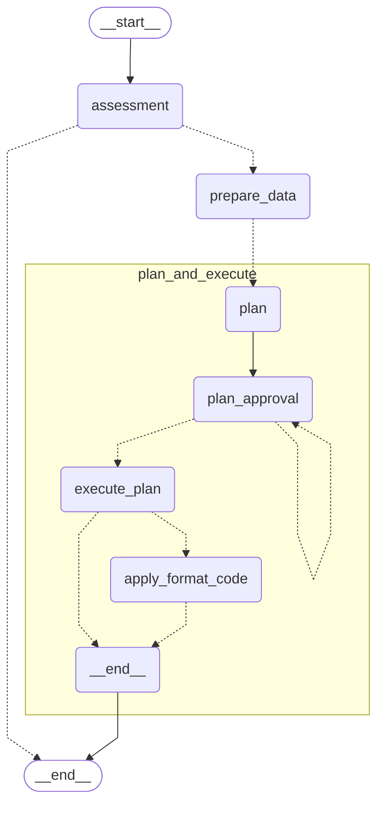

# 🚀 Issue Addressor

## What is the Issue Addressor?
The Issue Addressor is an AI agent that automates the process of addressing issues in your codebase. It generates a step-by-step plan to resolve an issue, executes the necessary code changes, and creates a merge request for review—all with minimal human intervention.

## Key Features
- **Automated issue analysis and planning**: Generates a detailed plan to address the issue.
- **Support for images**: The agent can process images in the issue description.
- **Approval workflow**: Waits for human approval before executing the plan.
- **Automated code changes**: Applies code changes as per the approved plan.
- **Merge request creation**: Opens a merge request with the changes for easy review.
- **Error handling and feedback**: Notifies users if planning or execution fails, and requests additional information if needed.

## How the Issue Addressor Works

 - The agent starts by assessing the issue, analyzing its title, description, and any attached images.
 - It prepares the necessary data and context for addressing the issue.
 - The agent delegates to the plan and execute subgraph, which:

    1. Generates a detailed step-by-step plan;
    2. Presents the plan for user approval;
    3. If approved, executes the plan and applies code formatting;
    4. If not approved, returns to planning.

 - After successful execution, the agent creates or updates a merge request with the changes.
 - The agent provides feedback throughout the process:

    * If planning fails, it requests clarification or error details;
    * If execution fails, it provides error details;
    * If successful, it notifies the user with the merge request link.

## Step-by-Step Usage Guide
1. **Create an Issue**

    Create a new issue in your repository with a title that starts with "DAIV:". For example, "DAIV: Fix login bug on mobile". The agent uses the issue's title and description to understand the problem.

2. **Review the Proposed Plan**

    The agent analyzes the issue and generates a plan. This plan is posted as a comment for your review.

3. **Approve or Edit the Plan**

    Review the plan. If it looks good, approve it. If not, edit the issue title and description to provide additional information and guide the agent to generate a new plan. The agent may also ask clarifying questions if the issue is ambiguous.

4. **Execute the Plan**

    Once approved, the agent executes the plan, making the necessary code changes in your repository.

5. **Review the Merge Request**

    The agent creates or updates a merge request with the changes. The agent will post a comment on the issue with the merge request link.

## Troubleshooting and FAQs
- **How do I know if the agent is working?**

    The agent will comment on the issue with a welcome message as soon as you create an issue with a title starting with 'DAIV:'.

- **What if no welcome message is posted?**

    Confirm that the issue title starts with "DAIV:". If it does, confirm that DAIV has access to the repository and DAIV webhook is configured.

- **What if the agent cannot generate a plan?**

    The agent will notify you and may ask clarifying questions. Provide more details in the issue title and description.

- **What if the agent cannot execute the plan?**

    The agent will comment on the issue with an error message. You can update the issue title and description to try again.

- **Can I reset the plan?**

    Yes, you can trigger a plan reset if the initial plan is not satisfactory. You can do this by updating the issue title and description.

- **What if the agent already created a merge request and I updated the issue title and description?**

    The agent will create a new merge request and all previous commits will be discarded.

## Additional Resources
- [Issue Addressor Agent Configurations](../getting-started/environment-variables.md#issue-addressor)
- [Plan and Execute Agent Configurations](../getting-started/environment-variables.md#plan-and-execute)
