# 🤖 AI Agents Overview

DAIV uses specialized AI agents to automate various development workflows in your GitLab repositories. Each agent is designed for specific tasks and can work independently or collaborate with other agents to provide comprehensive development assistance.

---

## How DAIV Agents Work

### Core Architecture

DAIV agents are built on a modular architecture that combines several key components:

**LangGraph Framework**: All agents use [LangGraph](https://langchain-ai.github.io/langgraph/) to create sophisticated workflows with state management, decision-making capabilities, and error handling.

**Language Models**: Agents support multiple LLM providers including:

- **Anthropic Claude** (Sonnet, Opus variants with thinking capabilities)
- **OpenAI GPT** (including reasoning models like o1, o3, o4)
- **Google Gemini**
- **OpenRouter** (access to various models)

**Repository Integration**: Direct integration with GitLab through webhooks and APIs for real-time repository monitoring and interaction.

**Context-Aware Processing**: Agents have access to indexed repository content, allowing them to understand your codebase structure, dependencies, and coding patterns.

### Agent Lifecycle

```mermaid
graph TD
    A["🔔 Trigger Event<br/>(Issue, PR, Pipeline Failure)"] --> B["📋 Agent Assessment<br/>(Analyze request and context)"]
    B --> C["📊 Data Preparation<br/>(Gather repository context)"]
    C --> D["🧠 Planning Phase<br/>(Generate action plan)"]
    D --> E["✅ Human Approval<br/>(Review and approve plan)"]
    E --> F["⚙️ Execution Phase<br/>(Implement changes)"]
    F --> G["🔍 Code Formatting<br/>(Apply repository standards)"]
    G --> H["📝 Create Merge Request<br/>(Submit for review)"]
    H --> I["💬 Feedback & Monitoring<br/>(Track progress and respond)"]
```



---

## Main Available AI Agents

### 🚀 Issue Addressor Agent

**Purpose**: Automatically resolves issues by implementing requested features or fixing bugs.

**Key Capabilities**:

- Analyzes issue descriptions and attached images
- Generates step-by-step implementation plans
- Creates code changes across multiple files
- Handles complex refactoring and new feature development

**Workflow**:

1. Triggered when issues are labeled with `daiv` or title starts with "DAIV:"
2. Analyzes issue context and repository structure
3. Generates an actionable plan for human review
4. Executes approved changes
5. Creates merge request with implemented solution

**[Learn more →](issue-addressor.md)**

### 🧠 Codebase Chat Agent

**Purpose**: Interactive Q&A assistant for your repository.

**Key Capabilities**:

- Answers questions about code structure and functionality
- Explains complex code patterns and implementations
- Provides development guidance and best practices
- Searches across repository content semantically and keyword-based
- OpenAI API compatible (chat completions)

**Workflow**:

- Available through chat interfaces like [OpenWebUI](https://openwebui.com/)
- Maintains conversation context
- Searches repository indexes for relevant information
- Provides code examples, explanations and references

**[Learn more →](codebase-chat.md)**

### 🔧 Pipeline Fixer Agent

**Purpose**: Automatically diagnoses and fixes failed CI/CD pipelines.

**Key Capabilities**:

- Analyzes pipeline failure logs and error messages
- Identifies root causes (syntax errors, test failures, dependency issues)
- Implements targeted fixes
- Applies code formatting to resolve linting issues

**Workflow**:

1. Triggered automatically on pipeline failures
2. Analyzes failure logs and repository state
3. Generates remediation plan
4. Applies fixes and re-runs validation

**[Learn more →](pipeline-fixing.md)**

### 📝 PR Describer Agent

**Purpose**: Generates comprehensive pull request descriptions.

**Key Capabilities**:

- Analyzes code changes and their impact
- Generates clear, detailed PR descriptions

**Workflow**:

- Triggered when PRs are created or updated
- Analyzes commits and changed files
- Generates structured description
- Updates PR with comprehensive details

### 🔍 Code Review Addressor Agent

**Purpose**: Responds to code review feedback by implementing requested changes.

**Key Capabilities**:

- Interprets reviewer comments and suggestions
- Implements code changes based on feedback
- Handles style, logic, and structural improvements
- Maintains conversation context across review cycles

**Workflow**:

1. Triggered by review comments on merge requests
2. Evaluates if comment requests code changes
3. Plans and implements requested modifications
4. Updates the merge request with changes
5. Responds to reviewer with explanation, if no changes requested

**[Learn more →](code-review-addressor.md)**

### 🎯 Plan and Execute Agent

**Purpose**: Core planning and execution engine used by other agents.

**Key Capabilities**:

- Breaks down complex tasks into actionable steps
- Manages multi-step workflows with approval gates
- Handles error recovery and replanning
- Coordinates between different tools and systems

**Used by**: Issue Addressor, Pipeline Fixer, and Review Addressor agents for their execution workflows.

---

## Agent Capabilities

### 🔧 MCP Tools Integration

Agents can use [Model Context Protocol (MCP)](mcp-tools.md) tools to extend their capabilities:

**Fetch Tools**: Web scraping and HTTP requests for researching solutions
**Sentry Integration**: Access to error monitoring and debugging information
**Custom Tools**: Extensible framework for adding specialized functionality

### 🗂️ Repository Tools

All agents have access to powerful repository manipulation tools:

- **Code Search**: Semantic and keyword-based code discovery
- **File Operations**: Create, modify, rename, and delete files
- **Snippet Replacement**: Precise code modification with context awareness

### 🏗️ Sandbox Environment

Agents can execute commands in isolated sandbox environments [daiv-sandbox](https://github.com/srtab/daiv-sandbox):

- **Code Formatting**: Apply repository-specific formatting rules (e.g. ruff, black, isort, etc.)
- **Custom Commands**: Execute repository-specific commands (e.g. install dependencies, etc.)

---

## Configuration and Customization

### Repository Configuration

Control agent behavior using a `.daiv.yml` file in your repository root.

**[Learn more about configuration →](../getting-started/repository-configurations.md)**

### Model Selection

Configure which AI models agents use through environment variables:

```bash
# Use Claude Sonnet for most tasks
PLAN_AND_EXECUTE_PLANNING_MODEL_NAME=openrouter:openai/gpt-4.1

# Use reasoning models for complex planning
PLAN_AND_EXECUTE_EXECUTION_MODEL_NAME=openrouter:openai/gpt-4.1
```

**[Learn more about model configuration →](../getting-started/environment-variables.md#automation-ai-agents)**

---

## Agent Communication and Collaboration

### Workflow Orchestration

Agents use **LangGraph** for sophisticated workflow management:

- **State Management**: Persistent state across workflow steps
- **Error Handling**: Automatic retry and fallback mechanisms
- **Human-in-the-Loop**: Approval gates for critical decisions

---

## Best Practices

### Maximizing Agent Effectiveness

**Write Clear Issues**: Provide detailed descriptions with examples and acceptance criteria

**Use Labels**: Apply the `daiv` label to issues you want automated

**Review Plans**: Always review agent-generated plans before approval

### Repository Setup

**Comprehensive Documentation**: Well-documented code helps agents understand context

**Clear Patterns**: Consistent code patterns make agent-generated code more accurate

**Test Coverage**: Good tests help agents validate their changes

**CI/CD Integration**: Proper pipeline configuration enables automatic fixing

### Security Considerations

**Review Changes**: Always review agent-generated code before merging

**Access Controls**: Configure appropriate repository permissions

**Sensitive Data**: Ensure no secrets are exposed in repository configurations

**Audit Trails**: Monitor agent activities through [LangSmith](../getting-started/monitoring.md)

---

## Troubleshooting

### Common Issues

**Poor Quality Responses**:

- Improve issue descriptions with more context
- Update repository description in `.daiv.yml`
- Consider adjusting model selection

### Getting Help

**Logs and Monitoring**: Check application logs for detailed error information

**Configuration Validation**: Use management commands to verify setup

**Community Support**: Join discussions and share experiences with other users

---

## Next Steps

Now that you understand how DAIV's agents work:

- **[Configure your first repository](../getting-started/configuration.md)** - Set up DAIV integration
- **[Explore specific agents](issue-addressor.md)** - Deep dive into individual agent capabilities
- **[Customize behavior](../getting-started/repository-configurations.md)** - Fine-tune agents for your workflow
- **[Monitor performance](../getting-started/monitoring.md)** - Track agent effectiveness and usage
