# ⚡ Quick Actions

Quick Actions provide command-based interactions with DAIV directly from GitLab issues and merge requests. They are useful for common tasks and information requests.

---

## Overview

Quick Actions are triggered by mentioning DAIV with specific commands in issue or merge request comments.

### How Quick Actions Work

**Command Format**: `@<daiv-username> <action> [arguments]`

**Supported Scopes**:

- **Issues**: Available in issue comments and discussions
- **Merge Requests**: Available in merge request comments and discussions

**Architecture**: Built on a plugin-based registry system that allows easy extension with custom actions.

---

## Available Quick Actions

### 🆘 Help Action

**Command**: `@daiv help`

**Purpose**: Displays all available Quick Actions for the current scope (issue or merge request).

**Scopes**: Issues, Merge Requests

**Example**:
```
@daiv help
```

**Response**: DAIV replies with a formatted list of all available Quick Actions and their descriptions.

---

## Using Quick Actions

### Basic Usage

1. **Navigate** to any GitLab issue or merge request
2. **Add a comment** mentioning DAIV with the desired action
3. **Submit** the comment
4. **DAIV responds** immediately with the action result

### Example Workflow

```mermaid
graph TD
    A["👤 User comments<br/>@daiv help"] --> B["🔍 DAIV parses command"]
    B --> C["📋 Registry lookup"]
    C --> D["⚡ Execute action"]
    D --> E["💬 Post response"]
```



### Command Parsing

Quick Actions use shell-like parsing with support for:

- **Simple commands**: `@daiv help`
- **Commands with arguments**: `@daiv action arg1 arg2`
- **Quoted arguments**: `@daiv action "argument with spaces"`
- **Case-insensitive**: `@DAIV HELP` works the same as `@daiv help`

---

## Troubleshooting

### Common Issues

**Action not recognized**:

- Check that the action supports the current scope (issue vs merge request)
- Ensure proper spelling and case (actions are case-insensitive)

**No response from DAIV**:

- Confirm DAIV has access to the repository
- Check that webhooks are properly configured
- Verify the bot username is correct in the mention

**Permission errors**:

- Ensure DAIV has sufficient GitLab permissions
- Confirm the user triggering the action has appropriate access levels

### Debug Information

Quick Actions log detailed information for troubleshooting:

- Command parsing results
- Registry lookup attempts
- Execution success/failure
- Error details and stack traces

---

## Examples

### Getting Help

```
@daiv help
```

**Response**:
```
You can trigger quick actions by commenting on this issue:
- `@daiv help` - Shows the help message with the available quick actions.
```

---

## Extension and Development

### Adding New Actions

1. **Create** new action class in `automation/quick_actions/actions/`
2. **Implement** required methods (`description` and `execute`)
3. **Decorate** with `@quick_action` specifying verb and scopes
4. **Import** in the actions module
5. **Test** the action in development environment

### Best Practices

- **Keep actions simple**: Quick Actions should execute immediately
- **Provide clear descriptions**: Help users understand what each action does
- **Handle errors gracefully**: Post user-friendly error messages
- **Use appropriate scopes**: Only enable actions where they make sense
- **Follow naming conventions**: Use clear, descriptive verb names
