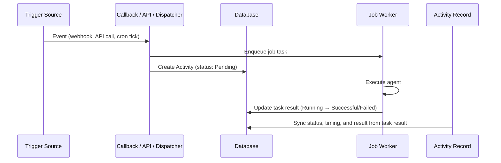

# Activity Tracking

DAIV records every agent execution — whether triggered by a webhook, the Jobs API, an MCP tool call, or a scheduled job — in a single Activity log. This gives you a unified view of what DAIV has been doing across all your repositories.

Navigate to **Dashboard > Activity** to see the full list, or click the run count on any [Scheduled Job](scheduled-jobs.md) to jump straight to that schedule's history.

---

## Trigger types

Each activity is tagged with the source that initiated it:

| Trigger | Source | Example |
|---------|--------|---------|
| **API Job** | [Jobs API](jobs-api.md) `POST /api/jobs` | A CI pipeline or script submits a prompt |
| **MCP Job** | [MCP Endpoint](mcp-endpoint.md) `submit_job` tool | Claude Code or Cursor delegates a task |
| **Scheduled Job** | [Scheduled Jobs](scheduled-jobs.md) cron dispatch | A weekly dependency audit fires on Monday |
| **Issue Webhook** | GitLab/GitHub issue event | An issue is labelled `daiv` |
| **MR/PR Webhook** | GitLab/GitHub merge request event | A reviewer mentions `@daiv` on a merge request |

---

## Activity list

The activity list shows all executions in reverse chronological order. Each entry displays:

- **Status indicator** — colour-coded dot (pending, running, successful, failed)
- **Summary** — the issue/MR number for webhook triggers, or the prompt text for jobs
- **Repository** — which repository the agent operated on
- **Trigger badge** — the trigger type (see above)
- **Timing** — when the activity was created and how long it ran

### Filtering

You can narrow the list using the filter controls at the top of the page:

| Filter | Description |
|--------|-------------|
| **Status** | Pending, Running, Successful, or Failed |
| **Trigger type** | API Job, MCP Job, Scheduled Job, Issue Webhook, or MR/PR Webhook |
| **Repository** | Search and select a specific repository |
| **Date range** | From / To date pickers |
| **Schedule** | Pre-applied when navigating from a scheduled job's run count |

Filters are combined with AND logic and are reflected in the URL query string, so filtered views can be bookmarked or shared.

### Live updates

Activities that are still running (Pending or Running) update automatically via server-sent events. The status dot and timing update in real time without needing to refresh the page.

---

## Activity detail

Click any activity to see its full detail page, which includes:

- **Trigger and status badges**
- **Metadata** — repository, branch/ref, timestamps (created, started, finished), duration, and linked schedule or issue/MR number
- **Prompt** — the full prompt sent to the agent (rendered as markdown)
- **Result** — the agent's output for successful runs (rendered as markdown), or the error traceback for failed runs

For in-flight activities, the detail page also updates in real time until the run completes.

### Result retention

Activity records are permanent, but the underlying task result (which holds the full output and traceback) is subject to the task backend's retention policy. When the task result is pruned, the activity still shows a denormalized summary and error message captured at completion time.

---

## How it works

Activity records are created at the point of dispatch — when a webhook callback, API view, MCP tool, or schedule dispatcher enqueues a job. The record stores the trigger type, repository, prompt, and a link to the background task result.

The `Activity` model denormalizes key fields (status, timestamps, result summary, error message) from the linked task result. This ensures the activity record remains useful even after the task result row is pruned by the retention policy.
