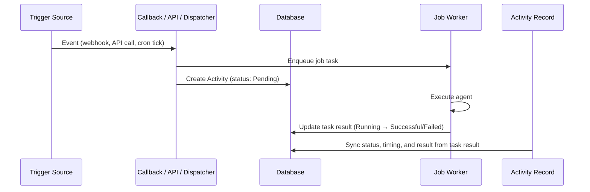

# Activity Tracking

DAIV records every agent execution — whether triggered by a webhook, the Jobs API, an MCP tool call, a scheduled job, or a run you start from the dashboard — in a single Activity log. This gives you a unified view of what DAIV has been doing across your repositories.

Navigate to **Dashboard > Activity** to see the list, or click the run count on any [Scheduled Job](scheduled-jobs.md) to jump straight to that schedule's history. You can also start a new run directly from this page (see [Starting a run from the dashboard](#starting-a-run-from-the-dashboard)).

!!! info "What you can see"
    Admins see all activity across every repository. Regular users see their own runs, runs matched to their git platform username (from webhook payloads), and runs on [Scheduled Jobs](scheduled-jobs.md) they subscribe to. The same scoping applies to the detail page, the live stream, and retries.

---

## Trigger types

Each activity is tagged with the source that initiated it:

| Trigger | Source | Example |
|---------|--------|---------|
| **API Run** | [Jobs API](jobs-api.md) `POST /api/jobs` | A CI pipeline or script submits a prompt |
| **MCP Run** | [MCP Endpoint](mcp-endpoint.md) `submit_job` tool | Claude Code or Cursor delegates a task |
| **Scheduled Run** | [Scheduled Jobs](scheduled-jobs.md) cron dispatch | A weekly dependency audit fires on Monday |
| **UI Run** | Dashboard run composer (see below) | You start a run from **Dashboard > Activity** |
| **Issue Webhook** | GitLab/GitHub issue event | An issue is labelled `daiv` |
| **MR/PR Webhook** | GitLab/GitHub merge request event | A reviewer mentions `@daiv` on a merge request |

---

## Activity list

The activity list shows all executions in reverse chronological order. Each entry displays:

- **Status indicator** — colour-coded dot (queued, pending, running, successful, failed)
- **Summary** — the issue/MR number for webhook triggers, or the prompt text for runs
- **Repository** — which repository the agent operated on
- **Trigger badge** — the trigger type (see above)
- **Timing and usage** — when the activity was created, how long it ran, and the total tokens consumed

!!! note "Queued runs"
    API and MCP runs that continue a thread already in flight don't start immediately. The new run is created in the **Queued** state and released in FIFO order once the prior run on that thread finishes.

### Filtering

You can narrow the list using the filter controls at the top of the page:

| Filter | Description |
|--------|-------------|
| **Status** | Queued, Pending, Running, Successful, or Failed |
| **Trigger type** | API Run, MCP Run, Scheduled Run, UI Run, Issue Webhook, or MR/PR Webhook |
| **Repository** | Search and select a specific repository |
| **Date range** | From / To date pickers |
| **Schedule** | Pre-applied when navigating from a scheduled job's run count |
| **Batch** | Pre-applied when viewing a multi-repo submission group (one prompt submitted across several repositories shares a batch ID) |

Filters are combined with AND logic and are reflected in the URL query string, so filtered views can be bookmarked or shared.

### Live updates

Activities that are still in flight (Queued, Pending, or Running) update automatically via server-sent events. The status dot and timing update in real time without needing to refresh the page.

---

## Activity detail

Click any activity to see its full detail page, which includes:

- **Trigger and status badges**
- **Context** — repository, branch/ref, linked schedule or issue/MR (the MR/PR is a clickable link), the agent model and thinking level used for the run, and the sandbox environment. Admins viewing another user's run also see the owning user.
- **Timing** — timestamps (created, started, finished) and duration
- **Usage** — total tokens, estimated cost, the input/output token split, and an optional per-model breakdown when more than one model was used
- **Prompt** — the full prompt sent to the agent (rendered as markdown)
- **Result** — the agent's output for successful runs (rendered as markdown), or the error traceback for failed runs

For successful runs you can copy the result or download it as a Markdown file. The download includes YAML front-matter with the repository, trigger, ref, timestamps, any issue/MR, and the token/cost totals.

For in-flight activities, the detail page also updates in real time until the run completes.

### Result retention

Activity records are permanent, but the underlying task result (which holds the full output and traceback) is subject to the task backend's retention policy. When the task result is pruned, the activity still shows a denormalized summary and error message captured at completion time, along with the token usage and cost figures — these are denormalized onto the activity and survive pruning.

---

## Starting a run from the dashboard

You don't have to wait for a webhook, schedule, or external client — you can launch an agent run by hand from the dashboard. Click **Start a run** on the Activity page (or open **Dashboard > Runs > New**) to reach the run composer.

The composer accepts:

- **Prompt** — what you want the agent to do
- **Repositories** — one or more repositories to run against. Submitting one prompt across multiple repositories creates a [batch](#filtering): each repository runs as an independent activity, and after submission you land on the batch-filtered Activity list.
- **Ref** — the starting branch or commit each run reads from (defaults to the repository's default branch)
- **Sandbox environment** — the [sandbox](sandbox.md) environment to run in
- **Agent model and thinking level** — per-run overrides for the model and reasoning effort (leave empty to inherit the repo defaults)
- **Notify me** — when to send a notification for this run

Runs started this way are tagged with the **UI Run** trigger. A single-repository submission takes you straight to its detail page; a multi-repository submission takes you to the batch-filtered list.

### Retrying a run

Any finished, non-webhook run is **retryable**. Open its detail page and click **Retry** to open the run composer pre-filled with the original run's prompt, repository, ref, and agent model/thinking level (`?from=<activity-id>`). Adjust anything you like before submitting — the retry is a fresh run, not an edit of the original. Issue and MR/PR webhook runs are not retryable from the dashboard.

---

## How it works

Activity records are created at the point of dispatch — when a webhook callback, API view, MCP tool, or schedule dispatcher enqueues a job. The record stores the trigger type, repository, prompt, and a link to the background task result.

The `Activity` model denormalizes key fields (status, timestamps, result summary, error message) from the linked task result. This ensures the activity record remains useful even after the task result row is pruned by the retention policy.
