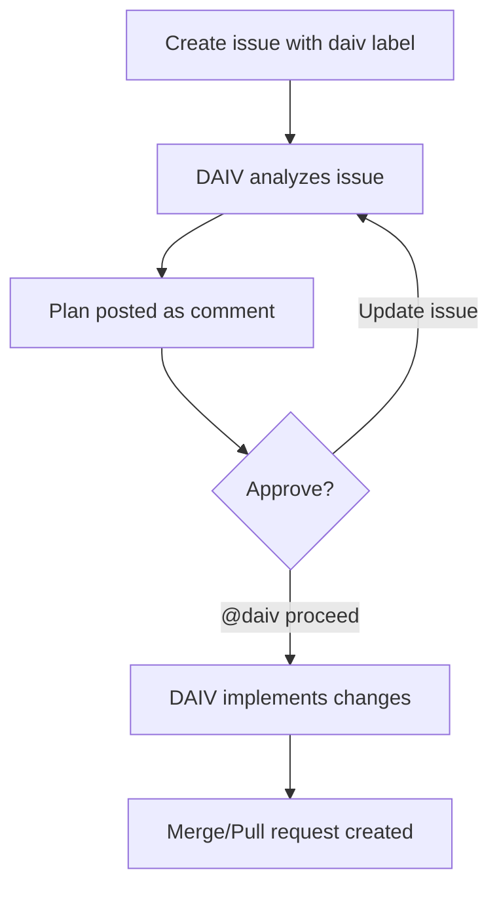

# Issue Addressing

Issue Addressing converts issue descriptions into working code. DAIV reads the issue, generates an implementation plan, waits for your approval, and opens a merge request (GitLab) or pull request (GitHub) with the changes.

## How it works

1. You create or update an issue and add a DAIV label
2. DAIV analyzes the issue title, description, and any attached images
3. DAIV posts a plan as a comment on the issue
4. You review and approve the plan
5. DAIV implements the changes and opens a merge/pull request



## Triggering

Add any of the following labels to an issue to trigger DAIV:

| Label | Behavior |
|-------|----------|
| `daiv` | Generates a plan and waits for approval before implementing |
| `daiv-auto` | Generates a plan and executes it immediately without waiting for approval |
| `daiv-max` | Uses a more capable model with deeper reasoning (see [Max mode](#max-mode)) |

Labels are case-insensitive (`DAIV`, `Daiv`, and `daiv` all work). You can combine them — for example, `daiv-auto` + `daiv-max` will auto-execute using the more capable model.

## Plan approval

By default, DAIV uses a **human-in-the-loop** approach. After generating a plan, it waits for explicit approval before making code changes.

To approve a plan, comment on the issue:

```
@daiv proceed
```

You can also provide feedback or additional instructions in your approval comment, and DAIV will take them into account during implementation.

!!! tip
    If you don't agree with the plan, comment with the changes you'd like and DAIV will update the plan accordingly.

## Max mode

The `daiv-max` label switches DAIV to a more capable model with a higher thinking level:

| Setting | Standard | Max |
|---------|----------|-----|
| Model | Configurable (default: Claude Sonnet) | Configurable (default: Claude Opus) |
| Thinking level | Configurable (default: medium) | Configurable (default: high) |

This is useful for complex issues that require more sophisticated analysis. Both the standard and max models can be configured via environment variables.

## Re-running

After a plan is executed, running a second plan on the same issue will update the existing merge/pull request rather than creating a new one.

If an unexpected error occurs during execution, DAIV creates a **draft** merge/pull request to preserve any changes already made.

## Configuration

Issue addressing is enabled by default. To disable it, add the following to your `.daiv.yml`:

```yaml
issue_addressing:
  enabled: false
```
