# 🤖 Issue Addressor

Issue Addressing is a feature that allows DAIV to address issues by generating a plan and executing the necessary code changes, opening a merge request (GitLab) or pull request (GitHub) with the changes for review.

## Configuration

Enable issue addressing in your `.daiv.yml` configuration file at the repository root:

```yaml
# Enable automated issue resolution
issue_addressing:
  enabled: true

quick_actions:
  enabled: true  # Required for /approve-plan command
```

| Option    | Type   | Default | Description                                 |
|-----------|--------|---------|---------------------------------------------|
| `enabled` | `bool` | `true`  | Enable or disable the issue addressing feature. |

!!! tip
    Issue addressing is enabled by default. Add `enabled: false` only if you want to disable it.

## Triggering runs

DAIV monitor issues for changes in the issue title, description, labels and state using webhooks. This streamlines the process of issuing a code change and requires no manual intervention to start a run.

**With Label**

You can trigger issue addressing by adding the `daiv` label to the issue.

**With Title**

You can trigger issue addressing by starting the issue title with `DAIV:` (e.g. 'DAIV: Add a new feature'). The prefix is case-insensitive, so you can use it as `daiv:` or `DAIV:`.

## Resetting the plan

You can reset the plan by:

  1. updating the issue title or description.
  2. leaving a comment with `@daiv /revise-plan`.

DAIV will automatically regenerate the plan.

## Plan Approval

DAIV uses a **human-in-the-loop** approach for plan approval. After generating a plan, DAIV waits for explicit approval before executing code changes.

### Approving the Plan

Execute the plan by commenting on the issue:

```
@daiv /approve-plan
```

DAIV will execute the plan and open a merge request (GitLab) or pull request (GitHub) with the changes for review.

!!! note
    Plan approval requires `quick_actions.enabled: true` in your `.daiv.yml` configuration.

### Why Manual Approval?

Manual plan approval provides:

- **Review opportunity**: Verify the plan before code changes are made
- **Safety**: Prevent unintended changes to your codebase
- **Control**: Choose when and which plans to execute

### Plan Execution Behavior

After a first plan is executed on an issue, executing a second plan will override the previous merge/pull request.

## Workflow

```mermaid
graph TD
    A["👤 Developer"] --> B["📝 Creates Issue<br/>(title starts with 'DAIV:')"]
    B --> C["🔔 Webhook Triggered"]
    C --> D["🤖 Issue Addressor Agent"]
    D --> E["📋 Analyzes Issue<br/>(title, description, images)"]
    E --> F["💡 Generates Plan"]
    F --> G["💬 Posts Plan as Comment<br/>(waits for approval)"]

    H["👤 Developer"] --> I["✅ Approves Plan<br/>(comments approval)"]
    I --> J["🔔 Comment Webhook"]
    J --> K["🔨 Executes Plan<br/>(plan_and_execute agent)"]
    K --> L["📝 Applies Code Changes"]
    L --> M["🎨 Code Formatting"]
    M --> N["📤 Creates Merge/Pull Request"]
    N --> O["💬 Posts MR/PR Link on Issue"]

    G --> P["❌ Plan Needs Changes"]
    P --> Q["📝 Developer Updates Issue"]
    Q --> R["🔄 Regenerates Plan"]
    R --> G

    style B fill:#e1f5fe
    style G fill:#fff3e0
    style I fill:#e8f5e8
    style N fill:#f3e5f5
```


