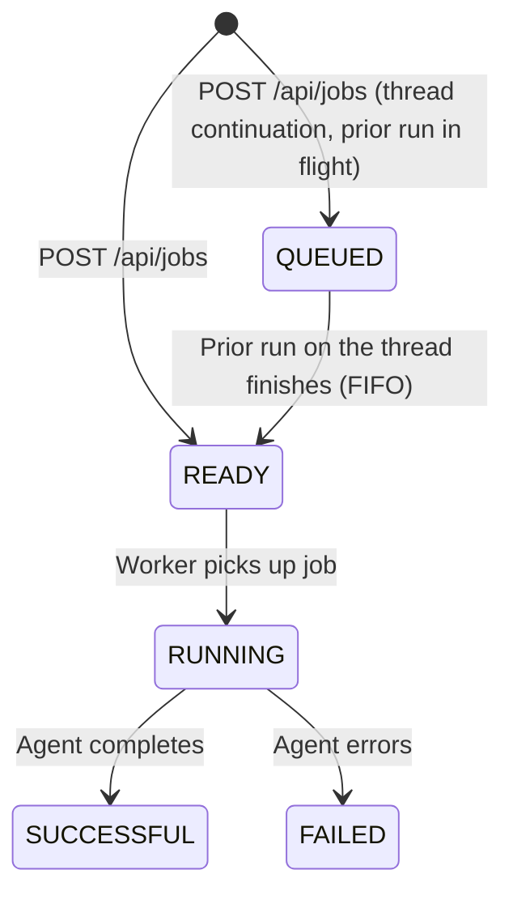

# Jobs API

The Jobs API lets you trigger DAIV agents programmatically — outside of the usual git webhook flow. Submit a prompt, get a job ID, and poll for the result.

This is useful when you want to:

- **Run agents on a schedule** — e.g., a GitLab CI pipeline that runs nightly
- **Chain agent tasks** — e.g., triage tickets, then create issues from the report
- **Trigger from external tools** — Slack bots, scripts, or custom integrations
- **Run ad-hoc tasks** — quick one-off agent executions via curl

## Authentication

The Jobs API uses **API key authentication** via Bearer tokens — the same mechanism used by the chat completions API.

### Creating an API key

```bash
python manage.py create_api_key <username> --name "my-key"
```

This outputs a key in the format `prefix.secret`. Store it securely — it cannot be retrieved later.

### Managing API keys

You can also self-service your API keys from the dashboard at `/accounts/api-keys/`. There you can:

- **Create** a key by giving it a name — the full secret is shown **only once**, right after creation, so copy it immediately.
- **List** your keys (admins see every user's keys).
- **Revoke** a key you no longer need; revoked keys stop authenticating immediately.

The `create_api_key` management command remains available for headless/automated provisioning.

### Using the key

Pass the key in the `Authorization` header:

```bash
curl -X POST https://daiv.example.com/api/jobs \
  -H "Authorization: Bearer <your-api-key>" \
  -H "Content-Type: application/json" \
  -d '...'
```

## Rate limiting

Job submissions are rate-limited per authenticated user. The default limit is **20 requests per hour**. When exceeded, the API returns `429 Too Many Requests`.

The rate is configured via the `jobs_throttle_rate` field in Site Configuration (default `20/hour`). Set it to a value like:

```
50/hour
```

Valid formats: `N/sec`, `N/min`, `N/hour`, `N/day` (or single-letter short forms: `N/s`, `N/m`, `N/h`, `N/d`).

!!! note
    The same rate can also be set with the `DAIV_JOBS_THROTTLE_RATE` environment variable (or Docker secret). When set, it is a hard override that wins over the database value and **locks** the field in the Site Configuration UI.

## Endpoints

### Submit a job

```
POST /api/jobs
```

**Request body:**

| Field                  | Type             | Required | Description |
|------------------------|------------------|----------|-------------|
| `repos`                | array of objects | yes      | 1–20 repositories to run against. Each item: `{ "repo_id": "group/project", "ref": "branch-or-sha" }` — `ref` is optional and defaults to the repository's default branch. |
| `prompt`               | string           | yes      | The prompt to send to the agent. The same prompt runs as an independent job against each repository in `repos`. |
| `agent_model`          | string           | no       | Override the model used for this batch. Invalid model / thinking-level combinations are rejected with `400`. |
| `agent_thinking_level` | string           | no       | Override the agent's reasoning effort. One of `minimal`, `low`, `medium`, `high`, `xhigh`. Invalid combinations are rejected with `400`. |
| `notify_on`            | string           | no       | Override the user's notification preference for this batch. One of `never`, `always`, `on_success`, `on_failure`. |
| `environment`          | string           | no       | Select a sandbox environment (by name or id) applied to every job in the batch. An unresolvable environment is rejected with `400`. |
| `thread_id`            | string (UUID)    | no       | Continue an existing thread. Requires exactly one repo in `repos`, and the most recent run on that thread must belong to you (otherwise `400`). If a prior run on the thread is still in flight, the new job is created in `QUEUED` state and released FIFO when that run finishes. |

!!! note
    The request body is validated strictly: unknown fields (including the removed `use_max` toggle) are rejected with `422`. Use `agent_model` and `agent_thinking_level` to control the model instead.

**Example:**

```bash
curl -s -X POST https://daiv.example.com/api/jobs \
  -H "Authorization: Bearer $DAIV_API_KEY" \
  -H "Content-Type: application/json" \
  -d '{
    "repos": [{"repo_id": "mygroup/myproject"}],
    "prompt": "List all Python files and summarize the project structure"
  }'
```

**Response (202 Accepted):**

```json
{
  "batch_id": "5b9e8a3c-9b7e-4c0d-a1f5-7e2c8d4b1a90",
  "jobs": [
    {
      "job_id": "1adfbf7a-917e-4f2e-8f54-17a27c006ec5",
      "repo_id": "mygroup/myproject",
      "ref": null,
      "thread_id": "9c1e8a3c-9b7e-4c0d-a1f5-7e2c8d4b1a90",
      "status": "READY"
    }
  ],
  "failed": []
}
```

Each entry in `jobs` is an independent run — poll each `job_id` separately. The `status` is `READY` for an immediately-runnable job, or `QUEUED` if another run is already in flight on the same `thread_id` (see [Job lifecycle](#job-lifecycle)). Pre-enqueue rejections (e.g. unknown `repo_id`) are reported in `failed` as `{repo_id, ref, error}`; the rest of the batch still runs.

### Poll job status

```
GET /api/jobs/{job_id}
```

**Response (200 OK):**

```json
{
  "job_id": "1adfbf7a-917e-4f2e-8f54-17a27c006ec5",
  "status": "SUCCESSFUL",
  "thread_id": "9c1e8a3c-9b7e-4c0d-a1f5-7e2c8d4b1a90",
  "result": "Here are the Python files...",
  "merge_request_url": null,
  "error": null,
  "created_at": "2026-03-27T18:22:39.012Z",
  "started_at": "2026-03-27T18:22:39.401Z",
  "finished_at": "2026-03-27T18:22:52.402Z"
}
```

`merge_request_url` is populated when the agent produced code changes that were committed and pushed; `null` otherwise (e.g. read-only triage runs). `thread_id` identifies the thread this job ran on — pass it back as the `thread_id` field on a new submission to continue the conversation.

**Status values:**

| Status | Meaning |
|--------|---------|
| `QUEUED` | Job is waiting for an earlier run on the same thread to finish; released FIFO. Only occurs for thread continuations (`thread_id` supplied). |
| `READY` | Job is queued, waiting for a worker |
| `RUNNING` | Agent is executing |
| `SUCCESSFUL` | Completed — `result` contains the agent's response summary |
| `FAILED` | Agent encountered an error — `error` contains a message |

**Error responses:**

For `GET /api/jobs/{job_id}`:

| Code | When |
|------|------|
| `404` | Job ID not found or invalid |
| `401` | Missing or invalid API key |

For `POST /api/jobs`:

| Code | When |
|------|------|
| `400` | Invalid request — bad `agent_model` / `agent_thinking_level` override, unresolvable `environment`, or invalid `thread_id` continuation (unknown/unowned thread, or more than one repo). |
| `422` | Malformed body or unknown fields (e.g. the removed `use_max`). |
| `429` | Rate limit exceeded (see [Rate limiting](#rate-limiting)). |
| `401` | Missing or invalid API key |

## Job lifecycle



A job only starts in `QUEUED` when you supply a `thread_id` and an earlier run on that thread is still in flight; it is released to `READY` (FIFO) when that run terminates. Every other submission starts at `READY`.

Once a job reaches `SUCCESSFUL` or `FAILED`, the status is final. The `result` field contains the agent's text response summary (its last response, truncated to 2000 characters) — not necessarily the complete output.

## Examples

### Simple script

```bash
#!/bin/bash
DAIV_URL="https://daiv.example.com"
API_KEY="your-api-key"

# Submit (single-repo batch)
JOB_ID=$(curl -s -X POST "$DAIV_URL/api/jobs" \
  -H "Authorization: Bearer $API_KEY" \
  -H "Content-Type: application/json" \
  -d '{"repos":[{"repo_id":"mygroup/myproject"}],"prompt":"List all TODO comments"}' \
  | jq -r '.jobs[0].job_id')

echo "Job submitted: $JOB_ID"

# Poll until done
while true; do
  RESPONSE=$(curl -s "$DAIV_URL/api/jobs/$JOB_ID" \
    -H "Authorization: Bearer $API_KEY")
  STATUS=$(echo "$RESPONSE" | jq -r '.status')

  case "$STATUS" in
    SUCCESSFUL) echo "$RESPONSE" | jq -r '.result'; break ;;
    FAILED)     echo "Job failed"; exit 1 ;;
    *)          sleep 10 ;;
  esac
done
```

### GitLab CI — Scheduled pipeline with chaining

Use the Jobs API from a scheduled GitLab CI pipeline to chain two agent tasks: triage support tickets, then create issues from the report.

```yaml
# .gitlab-ci.yml
triage-and-create-issues:
  rules:
    - if: $CI_PIPELINE_SOURCE == "schedule"
  script:
    # Step 1: Triage tickets
    - |
      JOB_ID=$(curl -s -X POST "$DAIV_URL/api/jobs" \
        -H "Authorization: Bearer $DAIV_API_KEY" \
        -H "Content-Type: application/json" \
        -d '{
          "repos": [{"repo_id": "mygroup/myproject"}],
          "prompt": "Triage the RT queue and identify code-related tickets. Return a summary with ticket IDs, descriptions, and priorities."
        }' | jq -r '.jobs[0].job_id')

    # Step 2: Poll until done
    - |
      while true; do
        STATUS=$(curl -s "$DAIV_URL/api/jobs/$JOB_ID" \
          -H "Authorization: Bearer $DAIV_API_KEY" | jq -r '.status')
        [ "$STATUS" = "SUCCESSFUL" ] && break
        [ "$STATUS" = "FAILED" ] && exit 1
        sleep 30
      done
      TRIAGE=$(curl -s "$DAIV_URL/api/jobs/$JOB_ID" \
        -H "Authorization: Bearer $DAIV_API_KEY" | jq -r '.result')

    # Step 3: Chain — create issues from the triage report
    - |
      curl -s -X POST "$DAIV_URL/api/jobs" \
        -H "Authorization: Bearer $DAIV_API_KEY" \
        -H "Content-Type: application/json" \
        -d "$(jq -n --arg prompt "Based on this triage report, create GitLab issues for each actionable item: $TRIAGE" \
          '{repos: [{repo_id: "mygroup/myproject"}], prompt: $prompt}')"
```

!!! tip
    Store `DAIV_URL` and `DAIV_API_KEY` as CI/CD variables in your GitLab project settings. Mark the API key as **masked** and **protected**.

## See also

- [Request Tracker Triage](../integrations/rt/index.md) — an end-to-end example of using the Jobs API from an RT Scrip to triage new support tickets automatically.
