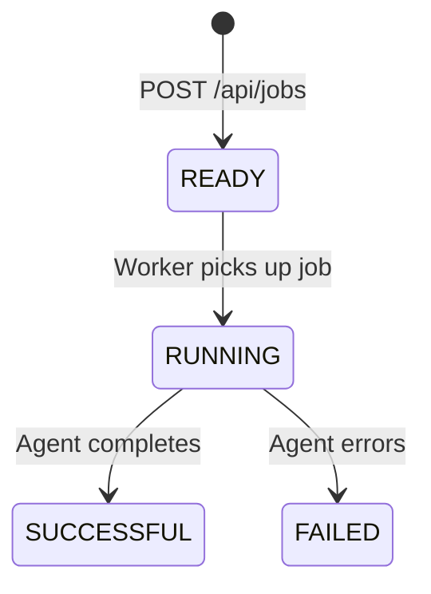

# Jobs API

The Jobs API lets you trigger DAIV agents programmatically — outside of the usual git webhook flow. Submit a prompt, get a job ID, and poll for the result.

This is useful when you want to:

- **Run agents on a schedule** — e.g., a GitLab CI pipeline that runs nightly
- **Chain agent tasks** — e.g., triage tickets, then create issues from the report
- **Trigger from external tools** — Slack bots, scripts, or custom integrations
- **Run ad-hoc tasks** — quick one-off agent executions via curl

## Authentication

The Jobs API uses **API key authentication** via Bearer tokens — the same mechanism used by the chat completions API.

### Creating an API key

```bash
python manage.py create_api_key <username> --name "my-key"
```

This outputs a key in the format `prefix.secret`. Store it securely — it cannot be retrieved later.

### Using the key

Pass the key in the `Authorization` header:

```bash
curl -X POST https://daiv.example.com/api/jobs \
  -H "Authorization: Bearer <your-api-key>" \
  -H "Content-Type: application/json" \
  -d '...'
```

## Rate limiting

Job submissions are rate-limited per authenticated user. The default limit is **20 requests per hour**. When exceeded, the API returns `429 Too Many Requests`.

The rate can be configured via the `DAIV_JOBS_THROTTLE_RATE` environment variable:

```
DAIV_JOBS_THROTTLE_RATE=50/hour
```

Valid formats: `N/second`, `N/minute`, `N/hour`, `N/day` (or short forms: `N/s`, `N/m`, `N/h`, `N/d`).

## Endpoints

### Submit a job

```
POST /api/jobs
```

**Request body:**

| Field     | Type   | Required | Description |
|-----------|--------|----------|-------------|
| `repo_id` | string  | yes      | Repository identifier (e.g., `group/project`) |
| `prompt`  | string  | yes      | The prompt to send to the agent |
| `ref`     | string  | no       | Git ref (branch/tag). Defaults to the repository's default branch |
| `use_max` | boolean | no       | Use the more capable model with thinking set to high. Defaults to `false` |

**Example:**

```bash
curl -s -X POST https://daiv.example.com/api/jobs \
  -H "Authorization: Bearer $DAIV_API_KEY" \
  -H "Content-Type: application/json" \
  -d '{
    "repo_id": "mygroup/myproject",
    "prompt": "List all Python files and summarize the project structure"
  }'
```

**Response (202 Accepted):**

```json
{
  "job_id": "1adfbf7a-917e-4f2e-8f54-17a27c006ec5"
}
```

### Poll job status

```
GET /api/jobs/{job_id}
```

**Response (200 OK):**

```json
{
  "job_id": "1adfbf7a-917e-4f2e-8f54-17a27c006ec5",
  "status": "SUCCESSFUL",
  "result": "Here are the Python files...",
  "error": null,
  "created_at": "2026-03-27T18:22:39.012Z",
  "started_at": "2026-03-27T18:22:39.401Z",
  "finished_at": "2026-03-27T18:22:52.402Z"
}
```

**Status values:**

| Status | Meaning |
|--------|---------|
| `READY` | Job is queued, waiting for a worker |
| `RUNNING` | Agent is executing |
| `SUCCESSFUL` | Completed — `result` contains the agent's output |
| `FAILED` | Agent encountered an error — `error` contains a message |

**Error responses:**

| Code | When |
|------|------|
| `404` | Job ID not found or invalid |
| `401` | Missing or invalid API key |

## Job lifecycle



Once a job reaches `SUCCESSFUL` or `FAILED`, the status is final. The `result` field contains the agent's full text output.

## Examples

### Simple script

```bash
#!/bin/bash
DAIV_URL="https://daiv.example.com"
API_KEY="your-api-key"

# Submit
JOB_ID=$(curl -s -X POST "$DAIV_URL/api/jobs" \
  -H "Authorization: Bearer $API_KEY" \
  -H "Content-Type: application/json" \
  -d '{"repo_id":"mygroup/myproject","prompt":"List all TODO comments"}' \
  | jq -r '.job_id')

echo "Job submitted: $JOB_ID"

# Poll until done
while true; do
  RESPONSE=$(curl -s "$DAIV_URL/api/jobs/$JOB_ID" \
    -H "Authorization: Bearer $API_KEY")
  STATUS=$(echo "$RESPONSE" | jq -r '.status')

  case "$STATUS" in
    SUCCESSFUL) echo "$RESPONSE" | jq -r '.result'; break ;;
    FAILED)     echo "Job failed"; exit 1 ;;
    *)          sleep 10 ;;
  esac
done
```

### GitLab CI — Scheduled pipeline with chaining

Use the Jobs API from a scheduled GitLab CI pipeline to chain two agent tasks: triage support tickets, then create issues from the report.

```yaml
# .gitlab-ci.yml
triage-and-create-issues:
  rules:
    - if: $CI_PIPELINE_SOURCE == "schedule"
  script:
    # Step 1: Triage tickets
    - |
      JOB_ID=$(curl -s -X POST "$DAIV_URL/api/jobs" \
        -H "Authorization: Bearer $DAIV_API_KEY" \
        -H "Content-Type: application/json" \
        -d '{
          "repo_id": "mygroup/myproject",
          "prompt": "Triage the RT queue and identify code-related tickets. Return a summary with ticket IDs, descriptions, and priorities."
        }' | jq -r '.job_id')

    # Step 2: Poll until done
    - |
      while true; do
        STATUS=$(curl -s "$DAIV_URL/api/jobs/$JOB_ID" \
          -H "Authorization: Bearer $DAIV_API_KEY" | jq -r '.status')
        [ "$STATUS" = "SUCCESSFUL" ] && break
        [ "$STATUS" = "FAILED" ] && exit 1
        sleep 30
      done
      TRIAGE=$(curl -s "$DAIV_URL/api/jobs/$JOB_ID" \
        -H "Authorization: Bearer $DAIV_API_KEY" | jq -r '.result')

    # Step 3: Chain — create issues from the triage report
    - |
      curl -s -X POST "$DAIV_URL/api/jobs" \
        -H "Authorization: Bearer $DAIV_API_KEY" \
        -H "Content-Type: application/json" \
        -d "$(jq -n --arg prompt "Based on this triage report, create GitLab issues for each actionable item: $TRIAGE" \
          '{repo_id: "mygroup/myproject", prompt: $prompt}')"
```

!!! tip
    Store `DAIV_URL` and `DAIV_API_KEY` as CI/CD variables in your GitLab project settings. Mark the API key as **masked** and **protected**.

## See also

- [Request Tracker Triage](../integrations/rt/index.md) — an end-to-end example of using the Jobs API from an RT Scrip to triage new support tickets automatically.
