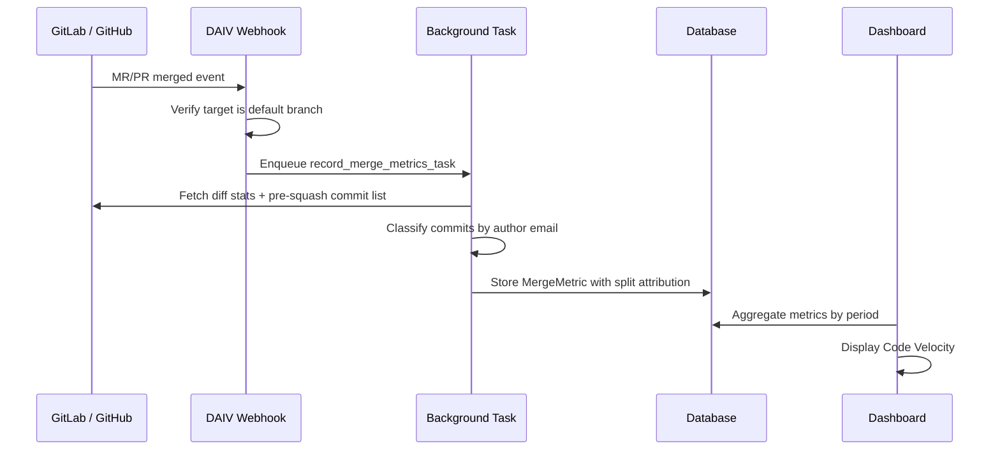

# Merge Metrics

DAIV automatically tracks code merge activity across your repositories. Every time a merge request (GitLab) or pull request (GitHub) is merged into a default branch, DAIV records diff statistics and attributes code changes to DAIV or human authors at the commit level.

---

## How it works



1. **Webhook receives a merge event** — GitLab sends a `merge_request` webhook with `action: merge`; GitHub sends a `pull_request` webhook with `action: closed` and `merged: true`.
2. **Default branch filter** — Only merges targeting the repository's default branch are recorded. Merges to feature or release branches are ignored.
3. **Background task** — A task fetches MR-level diff statistics and the pre-squash commit list from the platform API.
4. **Commit-based attribution** — Each commit's author email is compared against DAIV's known commit email. Lines added/removed are split into DAIV and human contributions. This works correctly even with squash merges because the platform API retains the original commit list.
5. **Dashboard** — The metrics are displayed in the "Code Velocity" section of the dashboard at `/dashboard/`, using the same period filter (7d / 30d / 90d / All time) as the agent activity counters.

---

## Dashboard

The Code Velocity section shows five counters:

| Counter | Description |
|---------|-------------|
| **Total merges** | Total MRs/PRs merged to default branches |
| **Lines added** | Total lines added across all merges |
| **Lines removed** | Total lines removed across all merges |
| **DAIV contribution** | Percentage of total lines (added + removed) authored by DAIV |
| **DAIV commit share** | Percentage of total commits authored by DAIV |

All counters respect the period filter at the top of the dashboard.

---

## Attribution

DAIV identifies its own commits by matching the commit author email against its configured bot email:

- **GitLab**: The bot's commit email (configured via `commit_email`, `public_email`, `email`, or fallback `{username}@users.noreply.gitlab.com`)
- **GitHub**: `{user_id}+{app_slug}[bot]@users.noreply.github.com`

### Mixed authorship

A single MR/PR can contain commits from both DAIV and human authors. For example, a human creates an MR, then asks DAIV to make follow-up changes via `@daiv`. The attribution correctly splits lines between DAIV and human based on individual commit authorship.

### Squash merges

When a MR/PR is squash-merged, the individual commits are collapsed into a single commit on the target branch. However, the platform API retains the original pre-squash commit list, so DAIV can still analyze individual commit authorship for accurate attribution.

---

## Setup

Merge metrics collection is enabled automatically. No configuration is required.

### Webhook events

DAIV registers the necessary webhook events on both platforms:

- **GitLab**: `merge_requests_events` (added alongside existing `push_events`, `issues_events`, `note_events`)
- **GitHub**: `pull_request` (added alongside existing `push`, `issues`, `pull_request_review`, `issue_comment`)

### Updating existing webhooks

If you already have DAIV connected to repositories, existing webhooks need to be updated to include the new event types.

**GitLab** — Run the setup command with the `--update` flag:

```bash
uv run manage.py setup_webhooks --update
```

The periodic webhook setup cron task does **not** pass `--update` by default, so this one-time manual step is needed after deploying the update.

**GitHub** — Update the webhook events in your GitHub App configuration to include `Pull requests` (if not already enabled). Alternatively, re-run webhook setup for your repositories.

---

## Diff stats

The way diff statistics are collected differs between platforms:

| Platform | MR-level stats | Per-commit stats |
|----------|---------------|-----------------|
| **GitLab** | Parses unified diff text from `mr.changes()` API | Fetches `project.commits.get(sha).stats` per commit (N+1 calls, capped at 100 commits) |
| **GitHub** | Reads `pr.additions`, `pr.deletions`, `pr.changed_files` directly | Fetches `commit.stats` per commit via lazy loading (N+1 calls, handled by PyGithub) |

If fetching diff stats or commits fails (e.g., due to API rate limits or network errors), the merge is still recorded with zero counts rather than being lost.

---

## Data model

Each merge event is stored as a `MergeMetric` record:

| Field | Type | Description |
|-------|------|-------------|
| `repo_id` | string | Repository identifier (e.g., `group/project` or `owner/repo`) |
| `merge_request_iid` | integer | MR IID (GitLab) or PR number (GitHub) |
| `title` | string | Merge request title (max 512 chars) |
| `lines_added` | integer | Total lines added in the merge |
| `lines_removed` | integer | Total lines removed in the merge |
| `files_changed` | integer | Number of files changed |
| `daiv_lines_added` | integer | Lines added in DAIV-authored commits |
| `daiv_lines_removed` | integer | Lines removed in DAIV-authored commits |
| `human_lines_added` | integer | Lines added in human-authored commits |
| `human_lines_removed` | integer | Lines removed in human-authored commits |
| `total_commits` | integer | Total number of commits in the MR |
| `daiv_commits` | integer | Number of commits authored by DAIV |
| `merged_at` | datetime | When the merge occurred |
| `source_branch` | string | Source branch name |
| `target_branch` | string | Target branch name |
| `platform` | enum | `gitlab` or `github` |

Records are unique per `(repo_id, merge_request_iid, platform)`. Duplicate webhook deliveries are handled via upsert.
