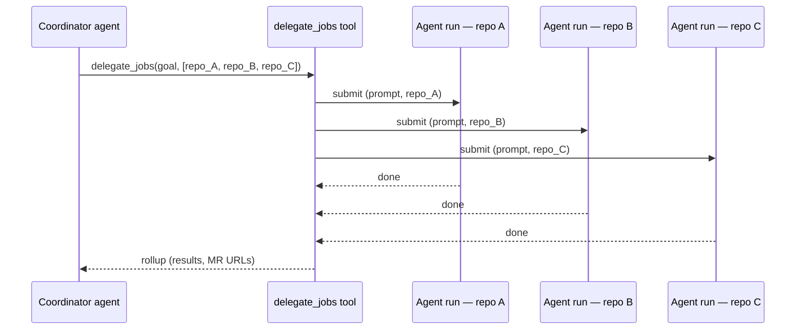

# Orchestration

Orchestration lets a DAIV agent fan work out to other repositories in a single step. When a task spans multiple codebases — shared libraries, microservices, a monorepo alongside its satellite packages — the agent can delegate sub-tasks in parallel rather than tackling each repository one after another.

This is useful when you want to:

- **Coordinate multi-repo changes** — e.g., bump a shared library version across every service that depends on it
- **Triage and route tickets automatically** — e.g., read an issue queue and dispatch each ticket to the right repository
- **Run parallel investigations** — e.g., check all affected services for a security advisory
- **Build a coordination-repo workflow** — one repository acts as the orchestrator; all the real work lands in the target repos

## How it works

When orchestration is enabled, the agent gains access to a `delegate_jobs` tool. The tool accepts a goal and a list of target repositories (each with its own optional prompt) and submits an independent agent run for every target — in parallel, via the same task backend used by the [Jobs API](jobs-api.md) and [Scheduled Jobs](scheduled-jobs.md).

Each delegated run executes with the per-repo configuration, skills, and sandbox of its own repository. When all delegated runs finish, the originating agent resumes and receives a rollup summary of the results — what each run produced, whether it succeeded, and any merge requests that were created.



## Enabling orchestration

Orchestration is opt-in per repository. Add the following to the repository's `.daiv.yml`:

```yaml
orchestration:
  enabled: true
```

The `delegate_jobs` tool is only bound to the agent when this flag is set. Attempting to call it from a repository where orchestration is disabled results in an error.

!!! note
    Only the **coordinator** repository needs `orchestration.enabled: true`. Target repositories do not require any special configuration — they just run normal agent jobs.

## Limits

| Limit | Value | Notes |
|-------|-------|-------|
| **Width** — targets per `delegate_jobs` call | 10 | The tool rejects a call with more than 10 `targets`. Split larger fan-outs across multiple calls. |
| **Depth** — maximum delegation chain | 2 | A delegated run cannot itself delegate beyond this depth. Setting `MAX_SPAWN_DEPTH=2` means: coordinator → delegated leg → no further delegation. |

!!! warning
    Depth is enforced at submission time. A delegated run that tries to call `delegate_jobs` when it is already at the maximum depth will receive an error and should handle it gracefully in its prompt.

## Per-target prompts

Each entry in the `targets` list accepts an optional `prompt` that overrides the shared goal for that specific repository. Use this when different repositories need different instructions:

```json
{
  "goal": "Apply the CVE-2026-12345 patch from the advisory",
  "targets": [
    { "repo_id": "mygroup/service-auth", "ref": "main" },
    { "repo_id": "mygroup/service-api",  "ref": "main", "prompt": "Update the auth dependency to 3.2.1 and run the integration tests" },
    { "repo_id": "mygroup/service-web",  "ref": "main" }
  ]
}
```

Targets without a `prompt` receive the shared `goal`. Targets with a `prompt` receive only their per-target `prompt` — the shared `goal` is not prepended automatically, so be explicit if you need it.

## Ticket-triage recipe

A common pattern is a **coordination repository** that holds no production code but acts as a routing hub for an external issue queue. The setup has three parts:

### 1. Attach a ticketing MCP server

Configure the coordination repository with an MCP tool integration that points at your ticketing system (e.g. Request Tracker, Jira, Linear). See [MCP Tools](../customization/mcp-tools.md) for how to wire up a per-repo MCP server.

### 2. Put routing knowledge in `.agents/AGENTS.md`

The coordination repository's `.agents/AGENTS.md` is the right place to describe how to map tickets to repositories:

```markdown
# Routing rules

- Tickets tagged `backend` or assigned to queue `Platform` → mygroup/service-api
- Tickets tagged `frontend` → mygroup/service-web
- Tickets tagged `auth` → mygroup/service-auth
- Unclassified tickets → skip, add comment "needs triage label"
```

The agent reads this file at the start of every run. Keep the routing rules up to date as your team's structure changes.

### 3. Trigger on a schedule (optional)

Use a [Scheduled Job](scheduled-jobs.md) on the coordination repository to poll the ticket queue at a regular interval — e.g., every hour — and dispatch the results automatically, without any manual prompt:

```
Scheduled prompt:
Fetch all open tickets from the RT queue that have not yet been dispatched.
For each ticket, follow the routing rules in AGENTS.md to pick the target repository,
then delegate_jobs with one target per ticket. Add a comment to each ticket with the
resulting merge request URL.
```

Combine this with the [Jobs API](jobs-api.md) to trigger an immediate dispatch from a webhook (e.g., on ticket-create) instead of — or alongside — the scheduled poller.

## Session view

Each `delegate_jobs` call produces a batch of child runs visible in the [Sessions](sessions.md) list. The coordinator run links to the batch; each child run shows its own transcript, run timeline, and any merge requests it produced. When all children finish, the coordinator resumes and the rollup appears in the coordinator's session transcript.

## See also

- [Jobs API](jobs-api.md) — programmatic job submission, including `thread_id` for continuation
- [Scheduled Jobs](scheduled-jobs.md) — recurring agent runs that can seed an orchestration workflow
- [MCP Endpoint](mcp-endpoint.md) — expose DAIV jobs to AI coding assistants via MCP
- [Repository Config](../customization/repository-config.md) — full reference for `.daiv.yml`
- [Agent Skills](../customization/agent-skills.md) — per-repo skills loaded into agent runs
