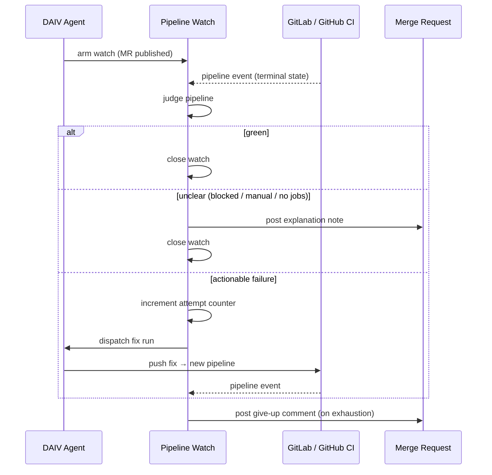

# Pipeline Watch

After DAIV publishes a merge request, it watches CI and spends up to a configurable number of agent runs trying to make it green. When the attempt budget is exhausted, DAIV comments on the merge request with the still-failing jobs and the pipeline link, and optionally sends an in-app notification.

---

## How it works



1. **Watch armed** — when a DAIV run publishes a merge request, the watch is activated on the MR's thread. The counter starts at zero and is never reset, so every fix run spends from the same budget.
2. **Pipeline event** — a webhook from GitLab (`pipeline_events`) or GitHub (`workflow_run`) delivers the terminal result. The watch also evaluates immediately on arming, because the CI event can arrive before the watch exists.
3. **Judgment** — see [Conservative judgment](#conservative-judgment) below.
4. **Fix run** — on an actionable failure, a run is dispatched on the MR's own branch and thread with a prompt naming the failed jobs and the pipeline URL. The agent reads the job logs using its trace tools and pushes a fix.
5. **Give up** — when the attempt counter reaches the cap, DAIV posts a comment on the MR with the failing jobs and the pipeline link, then closes the watch. A notification is sent to the session owner if one exists.
6. **No-diff early exit** — if a fix run produces no diff (nothing to commit), the watch ends immediately. No push means no pipeline and no future event, so the loop would never advance.
7. **Reconciler** — a cron task runs every 10 minutes to handle missed events and stuck states. A watch older than 6 hours is marked unclear regardless of state.

---

## Conservative judgment

DAIV errs toward stopping the watch rather than spending an attempt on something it cannot fix. The decision table:

Rows are evaluated top to bottom; the first match wins.

| Pipeline state | Jobs | Outcome |
|---|---|---|
| still in progress (`created`, `pending`, `running`, `preparing`, …), or no pipeline found | any | **Not judged** — watch stays armed, nothing posted |
| `blocked`, `manual`, `canceled`, `skipped` | any | **Unclear** — watch stops, MR note posted |
| any | zero jobs | **Unclear** — watch stops, MR note posted |
| `failed` | at least one non-`allow_failure` failed job | **Actionable** — fix run dispatched |
| `failed` | no job reports `failed` at all (e.g. a config error) | **Actionable** — fix run dispatched |
| `failed` | every failed job is `allow_failure` | **Green** — effectively a pass |
| `success` | at least one job | **Green** — watch ends |

**Why zero-job pipelines are unclear, not green:** a GitLab `.gitlab-ci.yml` that includes a cross-project template from a private repository resolves as the pushing identity. An ephemeral project-scoped token cannot read that private repository, so GitLab produces a pipeline with no jobs. Treating it as green would let a misconfigured pipeline pass silently; treating it as a failure would burn every attempt on a pipeline that was never going to run. Stopping the watch and posting a note is the only safe choice.

**Why blocked/manual/skipped/canceled are unclear:** these states reflect a human decision or an external gate. DAIV does not know whether to wait or act, so it stops and lets you decide.

**Why an in-progress pipeline is not judged at all:** the watch is armed immediately after DAIV pushes, so the first look almost always lands on a `created` / `pending` / `running` pipeline — or before one exists at all. Judging that would end every watch on the normal path, so a pipeline that has not reached a verdict is left alone and the watch waits for the next event or reconciler sweep. A pipeline that never starts is caught by the six-hour expiry. `blocked` and `manual` are *not* in this bucket: they are settled states that only a person resolves, so they end the watch with a note.

---

## Notifications

Only the **give-up** event triggers a notification. Green and unclear outcomes are silent — a short MR note explains unclear outcomes directly on the merge request. If the session has no associated DAIV user (common for webhook-origin sessions), the MR comment is still posted and a warning is logged; the comment is the reliable channel.

---

## Settings

### Site-wide

Configure under **Configuration → Pipeline Watch** in the dashboard (admin only). Both settings can also be set via environment variable or Docker secret, which takes precedence over the UI.

| Setting | Default | Description |
|---------|---------|-------------|
| `pipeline_watch_enabled` | `true` | Master switch. Set to `false` to disable the feature entirely. Env var: `DAIV_PIPELINE_WATCH_ENABLED`. |
| `pipeline_watch_max_attempts` | `3` | Maximum fix attempts per merge request (minimum 1). Env var: `DAIV_PIPELINE_WATCH_MAX_ATTEMPTS`. |

### Per repository

Override either setting per repository in `.daiv.yml`. A repository can only tighten or disable: the cap is clamped to the site-wide value, and `enabled: true` cannot switch the watch back on where the operator turned it off site-wide.

```yaml
pipeline_watch:
  enabled: true
  max_attempts: 2
```

| Option | Type | Default | Description |
|--------|------|---------|-------------|
| `pipeline_watch.enabled` | `bool` | site-wide | Disable watch for this repository by setting to `false`. |
| `pipeline_watch.max_attempts` | `int` | site-wide | Fix attempts before giving up on this repository. |

---

## Platform notes

### GitHub: `allow_failure` jobs

GitHub Actions does not expose per-job required-ness through the API, so DAIV treats every failed job as required. A `continue-on-error` job that fails will count as a real failure and trigger a fix run. This can spend one attempt without producing a meaningful fix, but it never misses a real failure.

### GitHub: one event per workflow, not per push

A `workflow_run` event reports a single workflow, not the branch's whole CI. A repository with several workflows on one push delivers one event per workflow, each judged on its own — so the first workflow to finish green can close the watch while another is still running or about to fail. Repositories that split required checks across workflows should expect the watch to end early.

### GitLab: merge-request pipelines and the reconciler poll

The reconciler's fallback poll lists pipelines by branch (`ref=<source branch>`). Detached merge-request pipelines are not on the branch ref — GitLab records them under `refs/merge-requests/<iid>/head` — so on projects that run *only* merge-request pipelines the poll finds nothing. This is harmless: a read that finds no pipeline never closes a watch, so those repositories are driven entirely by the pipeline webhook, with the six-hour expiry as the backstop.

---

## What pipeline watch does not do

- **Watches only MRs DAIV published.** There is no opt-in label to watch an existing merge request.
- **Does not distinguish flaky from real failures.** Every actionable failure goes to the agent; the attempt cap bounds the cost.
- **Does not react to CI on the default branch.** Watches are scoped to the merge request branch.

---

## Rollout: required step per platform

Pipeline watch needs a CI event to react to, and enabling that event is a different action on each platform. Until it is done the feature is **inert** — it never receives an event and never arms. That is a safe failure, but a silent one.

### GitLab — run the management command

GitLab webhooks are per repository, and `setup_webhooks` only creates hooks that do not exist yet; it skips repositories already onboarded. Adding `pipeline_events` to those existing hooks requires:

```bash
python manage.py setup_webhooks --update
```

Repositories onboarded after the upgrade get `pipeline_events` automatically.

### GitHub — change the GitHub App subscription

!!! warning "The management command does nothing on GitHub"
    `setup_webhooks` exits immediately when DAIV is configured for GitHub: an App's event
    subscriptions are centralized, not per repository, so there is no per-repository hook to
    update. Running `--update` on a GitHub install is a no-op.

Subscribe the App instead — this covers every repository it is installed on at once:

1. Open your GitHub App's settings page → **Permissions & events**.
2. Under **Subscribe to events**, check **Workflow run**.
3. Save. No re-installation or permission re-approval is needed for an event-only change.

See [Platform Setup](../getting-started/platform-setup.md) for the full event checklist.

---

## Related pages

- [Issue Addressing](issue-addressing.md) — the workflow that produces most DAIV-published merge requests
- [Pull Request Assistant](pull-request-assistant.md) — mention DAIV in a comment to request a manual pipeline fix
- [Sessions](sessions.md) — each fix run appears as a session on the MR thread
- [Notifications](notifications.md) — the give-up notification and how to mute it
- [Repository Config](../customization/repository-config.md) — full `.daiv.yml` reference
