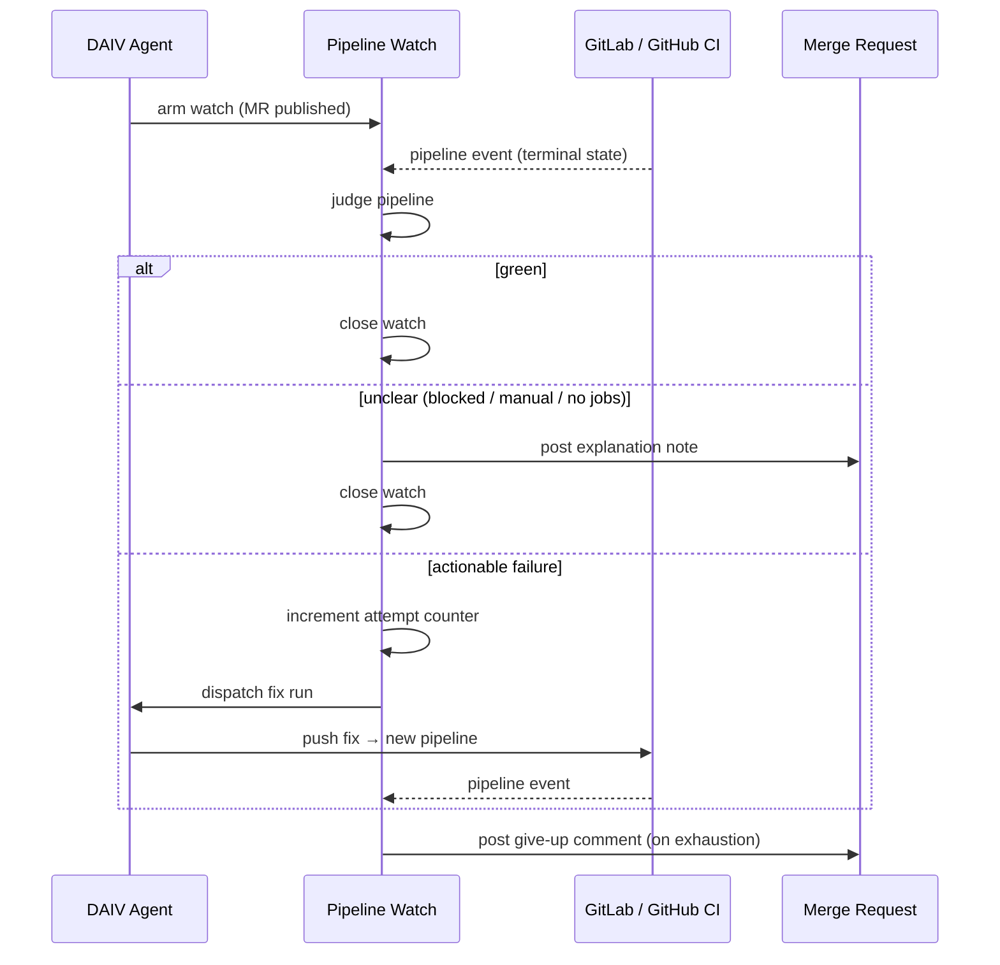

# Pipeline Watch

After DAIV publishes a merge request, it watches CI and spends up to a configurable number of agent runs trying to make it green. When the attempt budget is exhausted, DAIV comments on the merge request with the still-failing jobs and the pipeline link, and optionally sends an in-app notification.

---

## How it works



1. **Watch armed** — when a DAIV run publishes a merge request, the watch is activated on the MR's thread. The counter starts at zero and is never reset, so every fix run spends from the same budget.
2. **Pipeline event** — a webhook from GitLab (`pipeline_events`) or GitHub (`workflow_run`) delivers the terminal result. The watch also evaluates immediately on arming, because the CI event can arrive before the watch exists.
3. **Judgment** — see [Conservative judgment](#conservative-judgment) below.
4. **Fix run** — on an actionable failure, a run is dispatched on the MR's own branch and thread with a prompt naming the failed jobs and the pipeline URL. The agent reads the job logs using its trace tools and pushes a fix.
5. **Give up** — when the attempt counter reaches the cap, DAIV posts a comment on the MR with the failing jobs and the pipeline link, then closes the watch. A notification is sent to the session owner if one exists.
6. **No-diff early exit** — if a fix run produces no diff (nothing to commit), the watch ends immediately. No push means no pipeline and no future event, so the loop would never advance.
7. **Reconciler** — a cron task runs every 10 minutes to handle missed events and stuck states. A watch older than 6 hours is marked unclear regardless of state.

---

## Conservative judgment

DAIV errs toward stopping the watch rather than spending an attempt on something it cannot fix. The decision table:

| Pipeline state | Jobs | Outcome |
|---|---|---|
| `success` | any | **Green** — watch ends |
| `failed` | at least one non-`allow_failure` failed job | **Actionable** — fix run dispatched |
| `failed` | every failed job is `allow_failure` | **Green** — effectively a pass |
| `blocked`, `manual`, `canceled`, `skipped` | any | **Unclear** — watch stops, MR note posted |
| any terminal state | zero jobs | **Unclear** — watch stops, MR note posted |

**Why zero-job pipelines are unclear, not green:** a GitLab `.gitlab-ci.yml` that includes a cross-project template from a private repository resolves as the pushing identity. An ephemeral project-scoped token cannot read that private repository, so GitLab produces a pipeline with no jobs. Treating it as green would let a misconfigured pipeline pass silently; treating it as a failure would burn every attempt on a pipeline that was never going to run. Stopping the watch and posting a note is the only safe choice.

**Why blocked/manual/skipped/canceled are unclear:** these states reflect a human decision or an external gate. DAIV does not know whether to wait or act, so it stops and lets you decide.

---

## Notifications

Only the **give-up** event triggers a notification. Green and unclear outcomes are silent — a short MR note explains unclear outcomes directly on the merge request. If the session has no associated DAIV user (common for webhook-origin sessions), the MR comment is still posted and a warning is logged; the comment is the reliable channel.

---

## Settings

### Site-wide

Configure under **Configuration → Pipeline Watch** in the dashboard (admin only). Both settings can also be set via environment variable or Docker secret, which takes precedence over the UI.

| Setting | Default | Description |
|---------|---------|-------------|
| `pipeline_watch_enabled` | `true` | Master switch. Set to `false` to disable the feature entirely. Env var: `DAIV_PIPELINE_WATCH_ENABLED`. |
| `pipeline_watch_max_attempts` | `3` | Maximum fix attempts per merge request (minimum 1). Env var: `DAIV_PIPELINE_WATCH_MAX_ATTEMPTS`. |

### Per repository

Override either setting per repository in `.daiv.yml`. A repository can only tighten or disable; it cannot raise the cap above the site-wide value.

```yaml
pipeline_watch:
  enabled: true
  max_attempts: 2
```

| Option | Type | Default | Description |
|--------|------|---------|-------------|
| `pipeline_watch.enabled` | `bool` | site-wide | Disable watch for this repository by setting to `false`. |
| `pipeline_watch.max_attempts` | `int` | site-wide | Fix attempts before giving up on this repository. |

---

## Platform notes

### GitHub: `allow_failure` jobs

GitHub Actions does not expose per-job required-ness through the API, so DAIV treats every failed job as required. A `continue-on-error` job that fails will count as a real failure and trigger a fix run. This can spend one attempt without producing a meaningful fix, but it never misses a real failure.

---

## What pipeline watch does not do

- **Watches only MRs DAIV published.** There is no opt-in label to watch an existing merge request.
- **Does not distinguish flaky from real failures.** Every actionable failure goes to the agent; the attempt cap bounds the cost.
- **Does not react to CI on the default branch.** Watches are scoped to the merge request branch.

---

## Rollout: required step for existing repositories

!!! warning "Action required for existing repositories"
    `setup_webhooks` only creates new hooks; it skips repositories already onboarded. Adding
    `pipeline_events` (GitLab) and `workflow_run` (GitHub) to existing webhooks requires running:

    ```bash
    python manage.py setup_webhooks --update
    ```

    Until this runs, pipeline watch is **inert on every already-onboarded repository** — it will not receive CI events and will never arm. The feature works automatically for any repository onboarded after the upgrade.

---

## Related pages

- [Issue Addressing](issue-addressing.md) — the workflow that produces most DAIV-published merge requests
- [Pull Request Assistant](pull-request-assistant.md) — mention DAIV in a comment to request a manual pipeline fix
- [Sessions](sessions.md) — each fix run appears as a session on the MR thread
- [Notifications](notifications.md) — the give-up notification and how to mute it
- [Repository Config](../customization/repository-config.md) — full `.daiv.yml` reference
