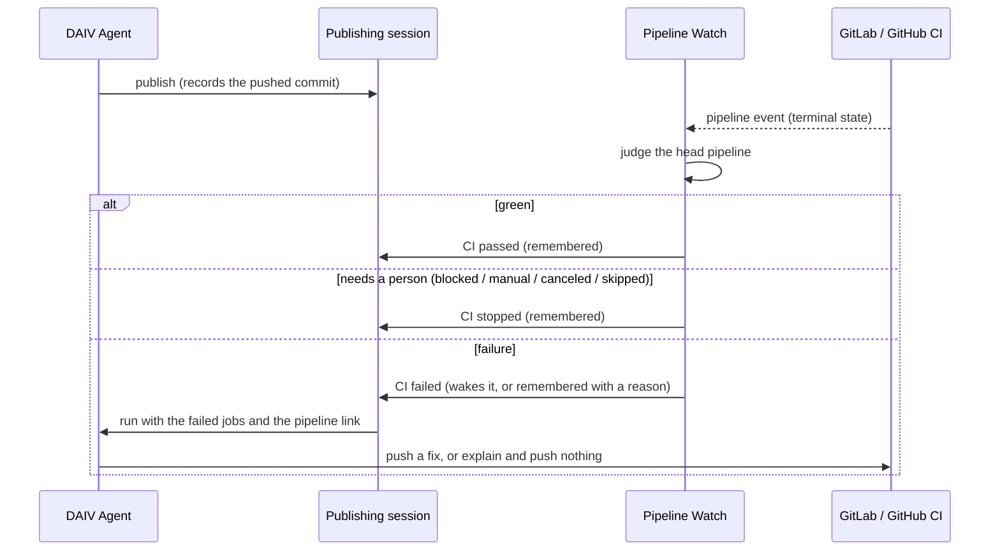

# Pipeline Watch

After DAIV publishes a merge request, it watches the merge request's CI and tells the session that published it what happened. A CI failure on a commit DAIV pushed wakes that session, up to a configurable number of times, to look at the failure and fix it; if the failure is not something a code change can fix, the run explains why instead of pushing. Everything else CI reports, a pass or a pipeline that needs a person, is remembered by the session and shown to the agent the next time it runs.

---

## How it works


```mermaid
sequenceDiagram
    participant Agent as DAIV Agent
    participant Session as Publishing session
    participant Watch as Pipeline Watch
    participant CI as GitLab / GitHub CI

    Agent->>Session: publish (records the pushed commit)
    CI-->>Watch: pipeline event (terminal state)
    Watch->>Watch: judge the head pipeline
    alt green
        Watch->>Session: CI passed (remembered)
    else needs a person (blocked / manual / canceled / skipped)
        Watch->>Session: CI stopped (remembered)
    else failure
        Watch->>Session: CI failed (wakes it, or remembered with a reason)
        Session->>Agent: run with the failed jobs and the pipeline link
        Agent->>CI: push a fix, or explain and push nothing
    end
```

1. **The publishing session owns the merge request** — when a run publishes, its session claims the merge request and records the commit DAIV pushed. A later publish from another session of the same person moves the merge request to that session; a publish from another person's session leaves it where it is and tells the owning session. See [Which runs claim the merge request](#which-runs-claim-the-merge-request).
2. **Pipeline event** — a webhook from GitLab (`pipeline_events`) or GitHub (`workflow_run`) delivers the terminal result. CI is also judged right after a publish, because the event can arrive before the claim exists. Only the merge request's head pipeline is judged; a pipeline an older push started is ignored.
3. **Judgment** — see [Conservative judgment](#conservative-judgment) below.
4. **Waking the session** — a failure wakes the owning session only when all of these hold. The first one that does not is recorded as the reason the failure was only remembered, and the agent sees it the next time it runs.

    | Condition | Reason when it fails |
    |---|---|
    | The watch is on for the repository and for this merge request | Watch off |
    | The session is not muted | Muted |
    | The pipeline ran on the commit DAIV last pushed | Not DAIV's commit |
    | No CI run looked at that commit yet | Already examined |
    | Attempts are left | Attempts spent |
    | DAIV has not started three runs in a row on the session without a person | Too many runs in a row |

5. **The CI run** — runs in the publishing session, on the merge request's branch, with a prompt naming the failed jobs and the pipeline URL. The agent reads the job logs through its `gitlab` / `gh` platform tool, then pushes a fix or explains why it pushed nothing. It can't ask a question: nobody is there to answer. If the session is busy, the failure waits and joins the session's next run.
6. **A run that pushes nothing** explains, without giving up. No push means no new pipeline, so the session shows CI as failing with a link to that run's explanation, and you receive its summary as a run notification. Retrying the same pipeline by hand does not wake the session again: the commit was already examined. If the retry passes, the session shows CI passing.
7. **Attempts spent** — when a failure on a new DAIV commit finds no attempts left, the merge request's owner is notified once for that commit. A run a person starts that publishes to the merge request gives the attempts back.
8. **Reconciler** — a cron task runs every 10 minutes and re-reads the latest pipeline of each watched merge request whose latest DAIV commit still has no CI result 30 minutes after it was pushed, for up to six hours. Nothing expires: the watch observes until the merge request is merged or closed. Each tick re-reads at most 200 branches.

---

## Conservative judgment

DAIV errs toward remembering rather than spending an attempt on something it cannot fix. The decision table:

Rows are evaluated top to bottom; the first match wins.

| Pipeline state | Jobs | Outcome |
|---|---|---|
| still in progress (`created`, `pending`, `running`, `preparing`, …), or no pipeline found | any | **Not judged** — nothing posted; the next event or the reconciler looks again |
| `skipped` | zero jobs | **Not judged** — a `ci.skip` push records this in place of a pipeline |
| `blocked`, `manual`, `canceled`, `skipped` | any | **Stopped** — remembered, shown as needing a person |
| any | zero jobs | **Stopped** — remembered, shown as needing a person |
| `failed` | at least one non-`allow_failure` failed job | **Failed** — may wake the session |
| `failed` | no job reports `failed` at all (e.g. a config error) | **Failed** — may wake the session |
| `failed` | every failed job is `allow_failure` | **Passed** — effectively a pass |
| `success` | at least one job | **Passed** |

**Why zero-job pipelines are stopped, not passed:** a GitLab `.gitlab-ci.yml` that includes a cross-project template from a private repository resolves as the pushing identity. An ephemeral project-scoped token cannot read that private repository, so GitLab produces a pipeline with no jobs. Treating it as green would let a misconfigured pipeline pass silently; treating it as a failure would burn every attempt on a pipeline that was never going to run.

**Why blocked/manual/skipped/canceled are stopped:** these states reflect a human decision or an external gate. DAIV does not know whether to wait or act, so it remembers the result and lets you decide.

---

## The session page

The session's top bar and details panel show CI for each open merge request the session owns: **Waiting for CI** while no result has arrived since DAIV last pushed or a run is looking at a failure, then **Passing**, **Failing** or **Needs a person**. A failing merge request links the last run that looked at a failure, whose summary says what it found.

**Fix CI failures** in the merge request menu turns the watch on or off for that merge request only. Turned off, CI results are still remembered but never wake the session. Turning it back on gives the merge request its attempts back and judges the pipeline it last judged again at once, so a failure reported while the watch was off, or out of attempts, wakes the session; a commit a run already looked at is not looked at again. Turning it on when it is already on changes nothing.

---

## Notifications

Every CI run produces the usual run notification, with the run's summary, so you hear what it found whether it pushed a fix or explained why it didn't. When attempts run out on a new DAIV commit, the merge request's owner gets one **CI still failing** notification for that commit, linking the owning session. A merge request whose owning session has no DAIV user behind it gets that outcome, and each CI run's summary, as a merge request comment instead.

---

## Settings

### Site-wide

Configure under **Configuration → Pipeline Watch** in the dashboard (admin only). Both settings can also be set via environment variable or Docker secret, which takes precedence over the UI.

| Setting | Default | Description |
|---------|---------|-------------|
| `pipeline_watch_enabled` | `true` | Master switch. Set to `false` to disable the feature entirely. Env var: `DAIV_PIPELINE_WATCH_ENABLED`. |
| `pipeline_watch_max_attempts` | `3` | Maximum fix attempts per merge request (minimum 1). Env var: `DAIV_PIPELINE_WATCH_MAX_ATTEMPTS`. |

### Per repository

Override either setting per repository in `.daiv.yml`. A repository can only tighten or disable: the cap is clamped to the site-wide value, and `enabled: true` cannot switch the watch back on where the operator turned it off site-wide.

```yaml
pipeline_watch:
  enabled: true
  max_attempts: 2
```

| Option | Type | Default | Description |
|--------|------|---------|-------------|
| `pipeline_watch.enabled` | `bool` | site-wide | Disable watch for this repository by setting to `false`. |
| `pipeline_watch.max_attempts` | `int` | site-wide | Fix attempts before giving up on this repository. |

---

## Platform notes

### GitHub: `allow_failure` jobs

GitHub Actions does not expose per-job required-ness through the API, so DAIV treats every failed job as required. The verdict itself still comes from the workflow run's own conclusion, so a tolerated job's failure cannot by itself spend an attempt — a run that concludes `success` is green. What differs from GitLab is narrower: DAIV cannot exclude a tolerated job from the failure list it hands the agent, and it never reads a failed run as green on the grounds that every failure was tolerated.

### GitHub: one event per workflow, not per push

A `workflow_run` event reports a single workflow, not the branch's whole CI. A repository with several workflows on one push delivers one event per workflow, each judged on its own — so the first workflow to finish green can show CI as passing while another is still running or about to fail. Repositories that split required checks across workflows should expect the status to flip as each workflow reports.

### GitLab: merge-request pipelines and the reconciler poll

The reconciler's fallback poll lists pipelines by branch (`ref=<source branch>`). Detached merge-request pipelines are not on the branch ref — GitLab records them under `refs/merge-requests/<iid>/head` — so on projects that run *only* merge-request pipelines the poll finds nothing. This is harmless: a read that finds no pipeline posts nothing, so those repositories are driven entirely by the pipeline webhook.

---

## Which runs claim the merge request

| How the merge request was published | Session that owns it |
|---|---|
| Issue addressing (`daiv` / `daiv-auto` label, or a mention on an issue) | The issue's session |
| Job runs — REST API, MCP `submit_job`, scheduled jobs | The job's session |
| Chat turn | The chat session |
| A CI run in the owning session | Stays with that session, keeping the attempts spent |
| Review addressing (DAIV answering comments on a merge request no session owns) | **None** |

Review addressing is excluded deliberately. It pushes to a merge request someone else may own, so babysitting that pipeline would put commits nobody asked for on their branch. Reviewers who want CI fixed can ask for it in a comment.

---

## What pipeline watch does not do

- **Watches only merge requests DAIV published.** There is no opt-in label to watch an existing merge request.
- **Does not distinguish flaky from real failures.** Every failure on DAIV's commit may wake the session; the attempt cap bounds the cost, and a run that finds nothing to fix says so.
- **Does not react to CI on the default branch.** The watch is scoped to the merge request's branch.

---

## Rollout: required step per platform

Pipeline watch needs a CI event to react to, and enabling that event is a different action on each platform. Until it is done the feature is **inert** — it never receives an event. That is a safe failure, but a silent one.

### GitLab — run the management command

GitLab webhooks are per repository, and `setup_webhooks` only creates hooks that do not exist yet; it skips repositories already onboarded. Adding `pipeline_events` to those existing hooks requires:

```bash
python manage.py setup_webhooks --update
```

Repositories onboarded after the upgrade get `pipeline_events` automatically.

### GitHub — change the GitHub App subscription

!!! warning "The management command does nothing on GitHub"
    `setup_webhooks` exits immediately when DAIV is configured for GitHub: an App's event
    subscriptions are centralized, not per repository, so there is no per-repository hook to
    update. Running `--update` on a GitHub install is a no-op.

Subscribe the App instead — this covers every repository it is installed on at once:

1. Open your GitHub App's settings page → **Permissions & events**.
2. Under **Repository permissions**, set **Actions** to **Read-only**. This is required to subscribe to **Workflow run** and to read job logs.
3. Under **Subscribe to events**, check **Workflow run**.
4. Save. If Actions is a new permission for the App, each installation owner must accept it, from GitHub's email or the installation's **Configure** page; until then, pipeline watch is inert on that installation.
5. After the next workflow run, check **Advanced → Recent Deliveries** for a `workflow_run` delivery.

See [Platform Setup](../getting-started/platform-setup.md) for the full event checklist.

---

## Related pages

- [Issue Addressing](issue-addressing.md) — the workflow that produces most DAIV-published merge requests
- [Pull Request Assistant](pull-request-assistant.md) — mention DAIV in a comment to request a manual pipeline fix
- [Sessions](sessions.md) — CI runs appear in the session that published the merge request
- [Notifications](notifications.md) — how run and give-up notifications are delivered
- [Repository Config](../customization/repository-config.md) — full `.daiv.yml` reference
