# ⚡ Quick Actions

Quick Actions provide command-based interactions with DAIV directly from issues and merge/pull requests. They are useful for common tasks and information requests.

---

## Quick Actions vs. Direct Mentions

DAIV responds to two types of interactions:

| Interaction Type | Format | Use Case |
|------------------|--------|----------|
| **Quick Actions** | `@daiv /command` | Execute specific commands (get help, clone issues) |
| **Direct Mentions** | `@daiv <request>` | Address code review comments, ask questions, request code changes |

**To address code review comments**, use a direct mention without a slash command. See [Review Addressor](review-addressor.md) for details and examples.

---

## Overview

Quick Actions are triggered by mentioning DAIV with specific commands in issue or merge/pull request comments.

### How Quick Actions Work

**Command Format**: `@<daiv-username> /<action> [arguments]`

**Supported Scopes**:

- **Issues**: Available in issue comments and discussions
- **Merge/Pull Requests**: Available in merge/pull request comments and discussions

**Command Parsing**:

Quick Actions use shell-like parsing with support for:

- **Simple commands**: `@daiv /help`
- **Commands with arguments**: `@daiv /clone-to-topic backend, api`
- **Case-insensitive**: `@DAIV /HELP` works the same as `@daiv /help`

### Workflow

```mermaid
graph TD
    A["👤 User"] --> B["💬 Comments with @daiv<br/>(e.g., '@daiv /help')"]
    B --> C["🔔 Comment Webhook"]
    C --> D["📝 Quick Action Parser<br/>(extracts command and args)"]
    D --> E["📋 Registry Lookup<br/>(finds matching action)"]

    E --> F["✅ Action Found?"]
    F -->|Yes| G["⚡ Execute Action"]
    F -->|No| H["❌ Unknown Action Error"]

    G --> I["🔍 Validate Scope<br/>(Issue vs Merge/Pull Request)"]
    I --> J["🛠️ Execute Specific Logic"]

    J --> K["📖 Help Action<br/>(show available commands)"]
    J --> R["📤 Clone to Topic<br/>(clone issue to repos)"]

    K --> N["💬 Posts Help Message"]
    R --> S["📋 Creates Issues in<br/>Matching Repositories"]

    H --> Q["💬 Posts Error Message<br/>(suggests valid actions)"]

    style B fill:#e1f5fe
    style E fill:#fff3e0
    style G fill:#e8f5e8
    style H fill:#ffebee
```



### Basic Usage

1. **Navigate** to any issue or merge/pull request
2. **Add a comment** mentioning DAIV with the desired action
3. **Submit** the comment
4. **DAIV responds** with the action result

---

## Available Quick Actions

### 🆘 Help Action

**Command**: `/help`

**Purpose**: Displays all available Quick Actions for the current scope (issue or merge/pull request).

**Scopes**: Issues, Merge/Pull Requests

**Example**:
```
@daiv /help
```

**Response**: DAIV replies with a formatted list of all available Quick Actions and their descriptions.

---

### 📤 Clone to Topic Action

**Command**: `/clone-to-topic <topics>`

**Purpose**: Clone the current issue to all repositories matching the specified topics.

**Scopes**: Issues only

**Arguments**: Comma-separated list of topics to match repositories against.

**Usage**: Leave a comment specifying the topics, and DAIV will create a copy of the issue in every matching repository (excluding the current one).

**Example**:
```
@daiv /clone-to-topic backend, microservices
```

**Response**: DAIV replies with a summary of the cloned issues, including links to each new issue created.

**Behavior**:

- Searches for repositories that have **all** the specified topics
- Excludes the current repository from the target list
- Copies the issue title, description, and labels to each target repository
- Reports how many issues were successfully created and lists them

---

## Troubleshooting

### Common Issues

**Action not recognized**:

- Check that the action supports the current scope (issue vs merge/pull request)
- Ensure proper spelling and case (actions are case-insensitive)
- Verify command syntax (e.g., `/help` not `/Help`)

**No response from DAIV**:

- Confirm DAIV has access to the repository
- Check that webhooks are properly configured
- Verify the bot username is correct in the mention

**Permission errors**:

- Ensure DAIV has sufficient repository permissions
- Confirm the user triggering the action has appropriate access levels

**Pipeline action issues**:

- Ensure the pipeline is in "failed" status
- Check that failed jobs have `script_failure` as the failure reason
- Verify jobs are not marked as `allow_failure`

**Clone to topic action issues**:

- Ensure you provide at least one topic
- Check that target repositories have the specified topics configured
- Verify DAIV has access to the target repositories
- Confirm the current repository is not the only one matching the topics

### Debug Information

Quick Actions log detailed information for troubleshooting:

- Command parsing results
- Registry lookup attempts
- Execution success/failure
- Error details and stack traces

---

## Examples

### Getting Help

```
@daiv /help
```

**Response**:
```
### 🤖 DAIV Quick-Actions
Comment one of the commands below on this issue to trigger the bot:

- `@daiv /help` - Shows the help message with the available quick actions.
- `@daiv /clone-to-topic <topics>` - Clone this issue to all repositories matching the specified topics.
```

---

### Cloning an Issue to Multiple Repositories

```
@daiv /clone-to-topic backend, api
```

**Response**:
```
Cloned issue to `3` repositories:
- org/service-users#42
- org/service-orders#18
- org/service-payments#27
```

---

## Extension and Development

### Adding New Actions

1. **Create** new action class in `quick_actions/actions/`
2. **Implement** required methods `execute_action` and `actions`
3. **Decorate** with `@quick_action` specifying command and scopes
4. **Import** in the actions module
5. **Test** the action in development environment

### Best Practices

- **Keep actions simple**: Quick Actions should execute immediately
- **Provide clear descriptions**: Help users understand what each action does
- **Handle errors gracefully**: Post user-friendly error messages
- **Use appropriate scopes**: Only enable actions where they make sense
- **Follow naming conventions**: Use clear, descriptive command names
