# ⚡ Quick Actions

Quick Actions provide command-based interactions with DAIV directly from issues and merge/pull requests. They are useful for common tasks and information requests.

---

## Overview

Quick Actions are triggered by mentioning DAIV with specific commands in issue or merge/pull request comments.

### How Quick Actions Work

**Command Format**: `@<daiv-username> <action> [arguments]`

**Supported Scopes**:

- **Issues**: Available in issue comments and discussions
- **Merge/Pull Requests**: Available in merge/pull request comments and discussions

**Command Parsing**:

Quick Actions use shell-like parsing with support for:

- **Simple commands**: `@daiv help`
- **Commands with sub-actions**: `@daiv plan execute`, `@daiv pipeline repair`
- **Multi-word sub-actions**: `@daiv pipeline repair apply`
- **Case-insensitive**: `@DAIV HELP` works the same as `@daiv help`

### Workflow

```mermaid
graph TD
    A["👤 User"] --> B["💬 Comments with @daiv<br/>(e.g., '@daiv help')"]
    B --> C["🔔 Comment Webhook"]
    C --> D["📝 Quick Action Parser<br/>(extracts verb and args)"]
    D --> E["📋 Registry Lookup<br/>(finds matching action)"]

    E --> F["✅ Action Found?"]
    F -->|Yes| G["⚡ Execute Action"]
    F -->|No| H["❌ Unknown Action Error"]

    G --> I["🔍 Validate Scope<br/>(Issue vs Merge/Pull Request)"]
    I --> J["🛠️ Execute Specific Logic"]

    J --> K["📖 Help Action<br/>(show available commands)"]
    J --> L["📋 Plan Action<br/>(regenerate/approve plan)"]
    J --> M["🔧 Pipeline Action<br/>(repair failed jobs)"]

    K --> N["💬 Posts Help Message"]
    L --> O["🔄 Triggers Plan Workflow"]
    M --> P["🚦 Triggers Pipeline Repair"]

    H --> Q["💬 Posts Error Message<br/>(suggests valid actions)"]

    style B fill:#e1f5fe
    style E fill:#fff3e0
    style G fill:#e8f5e8
    style H fill:#ffebee
```



### Basic Usage

1. **Navigate** to any issue or merge/pull request
2. **Add a comment** mentioning DAIV with the desired action
3. **Submit** the comment
4. **DAIV responds** with the action result

---

## Available Quick Actions

### 🆘 Help Action

**Command**: `@daiv help`

**Purpose**: Displays all available Quick Actions for the current scope (issue or merge/pull request).

**Scopes**: Issues, Merge/Pull Requests

**Example**:
```
@daiv help
```

**Response**: DAIV replies with a formatted list of all available Quick Actions and their descriptions.

---

### 📋 Plan Action

**Command**: `@daiv plan <sub-action>`

**Purpose**: Manage issue resolution plans with execute and revise operations.

**Scopes**: Issues only

**Sub-actions**:

#### Execute Plan
- **Command**: `@daiv plan execute`
- **Purpose**: Run or launch the current plan for the issue
- **Usage**: Comment in discussion to approve and execute the current plan

#### Revise Plan
- **Command**: `@daiv plan revise`
- **Purpose**: Discard current plan and create a new one from scratch
- **Usage**: Comment in discussion to reset and regenerate the plan

**Examples**:
```
@daiv plan execute
```
```
@daiv plan revise
```

---

### 🔧 Pipeline Action

**Command**: `@daiv pipeline <sub-action>`

**Purpose**: Manage merge/pull request pipeline failures with automated repair suggestions and execution.

**Scopes**: Merge/Pull Requests only

**Sub-actions**:

#### Repair Plan
- **Command**: `@daiv pipeline repair`
- **Purpose**: Suggest a repair plan to fix the failed pipeline
- **Usage**: Comment in discussion when pipeline has failed jobs
- **Trigger Location**: Discussion (initial comment)

#### Apply Repair
- **Command**: `@daiv pipeline repair apply`
- **Purpose**: Apply the repair plan to fix the pipeline
- **Usage**: Reply to repair plan discussion to execute the suggested fix
- **Trigger Location**: Reply (to existing repair discussion)

**Examples**:
```
@daiv pipeline repair
```
```
@daiv pipeline repair apply
```

**Requirements**:
- Pipeline must be in "failed" status
- Must have at least one failed job with script failure
- Job must not be marked as allowed to fail

---

## Troubleshooting

### Common Issues

**Action not recognized**:

- Check that the action supports the current scope (issue vs merge/pull request)
- Ensure proper spelling and case (actions are case-insensitive)
- Verify sub-action syntax (e.g., `plan execute` not `plan-execute`)

**No response from DAIV**:

- Confirm DAIV has access to the repository
- Check that webhooks are properly configured
- Verify the bot username is correct in the mention

**Permission errors**:

- Ensure DAIV has sufficient repository permissions
- Confirm the user triggering the action has appropriate access levels

**Pipeline action issues**:

- Ensure the pipeline is in "failed" status
- Check that failed jobs have `script_failure` as the failure reason
- Verify jobs are not marked as `allow_failure`

**Plan action issues**:

- Ensure you're commenting on an issue (not merge/pull request)
- Check if there's an existing plan to execute or revise

### Debug Information

Quick Actions log detailed information for troubleshooting:

- Command parsing results
- Registry lookup attempts
- Execution success/failure
- Error details and stack traces

---

## Examples

### Getting Help

```
@daiv help
```

**Response**:
```
### 🤖 DAIV Quick-Actions
Comment one of the commands below on this issue to trigger the bot:

- `@daiv help` - Shows the help message with the available quick actions.
- `@daiv plan execute` - Run or launch the current plan.
- `@daiv plan revise` - Discard current plan and create a new one from scratch.
```

---

## Extension and Development

### Adding New Actions

1. **Create** new action class in `automation/quick_actions/actions/`
2. **Implement** required methods `execute_action` and `actions`
3. **Decorate** with `@quick_action` specifying verb and scopes
4. **Import** in the actions module
5. **Test** the action in development environment

### Best Practices

- **Keep actions simple**: Quick Actions should execute immediately
- **Provide clear descriptions**: Help users understand what each action does
- **Handle errors gracefully**: Post user-friendly error messages
- **Use appropriate scopes**: Only enable actions where they make sense
- **Follow naming conventions**: Use clear, descriptive verb names
