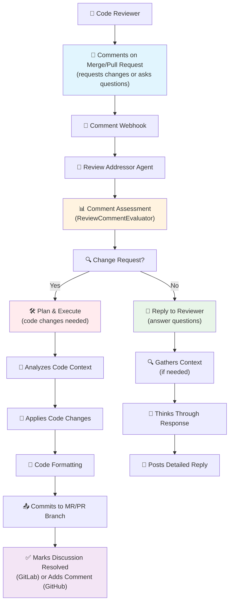

#### 💬 Code Review Response Workflow

```mermaid
graph TD
    A["👥 Code Reviewer"] --> B["💬 Comments on Merge/Pull Request<br/>(requests changes or asks questions)"]
    B --> C["🔔 Comment Webhook"]
    C --> D["🤖 Review Addressor Agent"]
    D --> E["📊 Comment Assessment<br/>(ReviewCommentEvaluator)"]

    E --> F["🔍 Change Request?"]
    F -->|Yes| G["🛠️ Plan & Execute<br/>(code changes needed)"]
    F -->|No| H["💬 Reply to Reviewer<br/>(answer questions)"]

    G --> I["📝 Analyzes Code Context"]
    I --> J["🔨 Applies Code Changes"]
    J --> K["🎨 Code Formatting"]
    K --> L["📤 Commits to MR/PR Branch"]
    L --> M["✅ Marks Discussion Resolved<br/>(GitLab) or Adds Comment (GitHub)"]

    H --> N["🔍 Gathers Context<br/>(if needed)"]
    N --> O["💭 Thinks Through Response"]
    O --> P["💬 Posts Detailed Reply"]

    style B fill:#e1f5fe
    style E fill:#fff3e0
    style G fill:#ffebee
    style H fill:#e8f5e8
    style M fill:#f3e5f5
```
