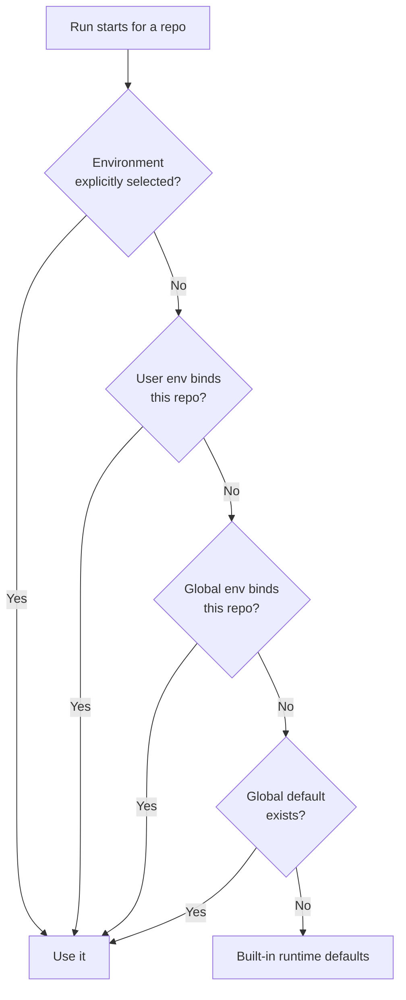

# Sandbox Environments

A sandbox environment is a named, reusable [sandbox](sandbox.md) configuration — base image, CPU and memory limits, network access, encrypted environment variables, and the repositories it applies to. Define it once in the dashboard and DAIV reuses that runtime across every run, chat, scheduled job, and API/MCP call that lands in a matching repository, instead of reconfiguring the container each time.

Manage environments at **Dashboard > Sandbox Environments** (`/dashboard/sandbox-envs/`). The page lists your own environments and, separately, the organization-wide ones.

!!! info "When you need one"
    The sandbox runs with **networking disabled** and **no base image** unless an environment supplies them. If the agent needs to install dependencies, run a specific toolchain image, or read a secret (an API token, a private registry credential), capture that in an environment. See [Sandbox](sandbox.md) for what the agent does with the runtime.

## Scopes

Every environment has one of two scopes:

| Scope | Visibility | Who can manage it | Repository default |
|-------|-----------|-------------------|--------------------|
| **User** | Private to you | You (the owner) | — |
| **Global** | Shared with everyone | Administrators only | One environment can be the single global default |

When resolving the runtime for a repository, a **User** environment that claims that repository wins over a **Global** one, so you can override an organization-wide setup with your own for the repositories you care about.

!!! note "Global environments are admin-only"
    Only administrators can create, edit, delete, or set the default of a **Global** environment. Non-admins can still *select* and *read* global environments (secret values stay masked), but the scope dropdown offers only **User** when you create one.

### The single global default

Exactly one **Global** environment may be marked as the default. It is the fallback the runtime uses when no other environment matches a repository (see [How an environment is resolved](#how-an-environment-is-resolved)). Administrators promote a different environment to default from the list (the **Set default** action, `POST /dashboard/sandbox-envs/<uuid>/set-default/`); promoting one automatically demotes the previous default. You cannot delete the current global default — promote another environment first.

## Creating an environment

Click **Create** on the list page to open the drawer (`/dashboard/sandbox-envs/create/`), or **Edit** an existing one (`/dashboard/sandbox-envs/<uuid>/edit/`). The form has these fields:

| Field | Description |
|-------|-------------|
| **Name** | A short label, unique within its scope. Required |
| **Description** | Optional free text |
| **Scope** | **User** (private) or **Global** (admin-only, shared) |
| **Base image** | The container image the sandbox runs, e.g. `python:3.14-slim`. Required |
| **CPUs** | CPU limit (a number, up to two decimals). Switch from *default* to *custom* to set it; leave on *default* to inherit |
| **Memory** | Memory limit, entered as a value plus a **MiB** or **GiB** unit. Switch from *default* to *custom* to set it |
| **Network** | **On** or **Off**. Controls outbound network access (needed to reach package registries) |
| **Environment variables** | Name/value pairs injected into the sandbox; mark any as secret (see below). Up to 100 entries |
| **Egress policy** | Per-host outbound rules, injected credentials, and traffic mode. Shown only when **Network** is **On** (see [Network access and egress policy](#network-access-and-egress-policy)) |
| **Repositories** | The repository IDs this environment is bound to, as slash-separated paths like `owner/repo` or `group/subgroup/repo` (see [Repository bindings](#repository-bindings)) |

Leaving **CPUs** or **Memory** on *default* means the field is unset, and the value falls back to the global default's value (or the built-in runtime default) at run time. **Network** is explicit per environment (**On**/**Off**) and is *not* inherited from the global default — see [How an environment is resolved](#how-an-environment-is-resolved).

### Environment variables (encrypted at rest)

Environment-variable values are **Fernet-encrypted before they are stored** and decrypted only when a run needs them. Encryption uses `DAIV_ENCRYPTION_KEY` (see [Environment Variables](../reference/env-variables.md)).

- Each entry has a **name** (a valid shell identifier: letters, digits, underscores, not starting with a digit) and a **value**.
- Mark a value as **secret** to mask it in the dashboard and in API/MCP responses (shown as `******`, never echoed back). Re-saving the form keeps a masked secret unchanged unless you type a new value.
- Limits: at most **100** variables, and the encrypted blob may not exceed **32 KiB**.

!!! warning "Rotating the encryption key"
    If `DAIV_ENCRYPTION_KEY` changes and stored values can no longer be decrypted, the form blocks saving until you re-enter every secret value. Agent runs don't crash on this — they drop the unreadable variables and continue.

### Network access and egress policy

When **Network** is enabled, the **Egress** section appears at the bottom of the form. It lets you define exactly which outbound connections the sandbox container may make, with optional per-host credentials injected by the MITM proxy — credentials never enter the container.

!!! info "Requires the egress proxy"
    Egress policy is provisioned by the daiv-sandbox MITM egress proxy. If the sandbox does not have the egress proxy enabled, starting a run that uses an egress-configured environment will **abort** (fail-closed) rather than fall back to unrestricted network.

!!! note "The repository's git platform is always reachable"
    DAIV runs git — including the publish push — from *inside* the sandbox, so the run's own git platform (GitLab/GitHub) is **always allowed and authenticated**, even when **Network** is **Off**. DAIV injects a runtime-only rule for the platform host (credentialed with a short-lived, platform-minted token — project-scoped on GitLab, installation-scoped on GitHub) so `git fetch`/clone/push of the repository works without you listing it. You never configure this — and a **Network Off** environment is otherwise still fully isolated: it is opened *only* for the git platform, and only when a push token exists (eval/benchmark runs, which hold none, stay completely network-isolated).

#### Allowed hosts

Each row in the **Allowed hosts** table defines one outbound rule:

| Column | Description |
|--------|-------------|
| **Host** | A hostname or glob pattern (e.g. `pypi.org`, `*.github.com`). Requests to hosts not on this list are blocked |
| **Methods** | HTTP methods this rule applies to (leave empty to match all methods) |
| **Credential** | Optional: an HTTP header name and value injected by the proxy for every request to this host (see below) |

An egress policy takes effect only when you add at least one allowed-host rule. With **Default** set to `deny`, only the listed hosts are reachable and every other outbound request is blocked. Leaving the allowed-hosts list empty stores **no** egress policy on the environment (the section is treated as untouched) — it does not block traffic. To disable general networking, set **Network** to **Off** (the repository's own git platform stays reachable so DAIV can still publish — see the note above).

#### Per-host credentials (encrypted at rest)

Each allowed host may carry an optional credential — an HTTP header name and value (for example, `Authorization` / `Bearer <token>`) that the proxy injects into matching requests. Credential values are **Fernet-encrypted before they are stored**, shown as `••••••` once saved, and never rendered back to the browser or returned by the API/MCP. Re-saving the form preserves a masked credential unchanged unless you explicitly type a new value.

Limits: at most **100** allowed-host rules and **100** credentials, and the encrypted secrets blob may not exceed **32 KiB**.

#### Traffic mode

Two toggles control how the MITM proxy handles traffic:

| Toggle | Options | Description |
|--------|---------|-------------|
| **Default** | `deny` / `allow` | What happens to requests that do not match any allowed-host rule. `deny` (the recommended default) blocks them; `allow` passes them through unrestricted |
| **Intercept** | `all` / `credentialed` | Which connections the proxy performs TLS interception on. `all` intercepts every HTTPS request (needed to inject credentials into TLS traffic); `credentialed` intercepts only hosts that have a credential configured |

### Repository bindings

The **Repositories** field is a list of repository IDs (`owner/repo`, `group/subgroup/repo`, …) that this environment claims. Bindings drive [auto-resolution](#how-an-environment-is-resolved): when an agent runs in a bound repository and no environment is explicitly selected, this environment is chosen automatically.

A repository ID may be claimed by at most one environment **within the same scope** for the same owner — saving a binding that overlaps another of your User environments (or another Global environment) is rejected with the name of the conflicting environment. The same repository can still appear in both a User environment and a Global one; the User binding takes precedence.

## How an environment is resolved

When a run starts in a repository, DAIV picks the per-run environment using this precedence (per repository):

1. **Explicit selection** — an environment chosen for the run (the picker in the dashboard, the `environment` argument to the [Jobs API](jobs-api.md)/[MCP](mcp-endpoint.md), or the chat header). Selecting an environment overrides all binding/default logic.
2. **User repository binding** — your **User** environment whose **Repositories** list contains this repository.
3. **Global repository binding** — a **Global** (non-default) environment whose **Repositories** list contains this repository.
4. **Global default** — the single **Global** environment marked as default.
5. **None** — if nothing matches, the sandbox uses its built-in runtime defaults (no base image, networking off).

The selected per-run environment is then **merged with the global default** to produce the effective runtime: for each resource field (base image, memory, CPUs) the per-run environment wins when it sets a value, otherwise the global default's value applies, otherwise the runtime default. **Network (egress) is the exception — it is explicit per environment and is never inherited**: a per-run environment with **Network** off does not inherit the global default's egress policy (only the repository's own git platform stays reachable, so DAIV can publish). Environment variables from both are unioned, with the per-run environment's keys shadowing the global default's.

!!! note "Webhook-triggered runs"
    Runs triggered by a webhook (for example, [issue addressing](issue-addressing.md)) have no signed-in DAIV user, so step 2 (User bindings) is skipped — resolution starts at Global bindings and falls back to the global default.



## Selecting an environment for a run

You don't have to bind an environment to a repository — you can pick one explicitly per run. An explicit selection always wins over bindings and the default.

### From the dashboard run composer

When you start a run from **Dashboard > Activity** (or from an [Activity](activity-tracking.md) detail page), the composer includes a **Sandbox environment** picker listing your User environments and all Global ones. Leave it on **(global default)** to use [auto-resolution](#how-an-environment-is-resolved).

### From chat

The dashboard [chat](chat.md) workspace remembers the environment chosen when the thread is created (sent as the `X-Sandbox-Env` header, by name or UUID). Omitting it auto-resolves the environment for the thread's repository. The chosen environment is snapshotted on thread creation, so an existing thread keeps the environment it started with.

### From a scheduled job

A [Scheduled Job](scheduled-jobs.md) has a **Sandbox environment** field. Set it to pin every run of that schedule to one environment, or leave it unset to fall back to per-repository auto-resolution for each target repo.

### From the Jobs API

`POST /api/jobs` accepts an optional `environment` field (an environment **name or UUID**, visible to the calling user). It applies to every repository in the batch. Omit it to auto-resolve per repository.

```json
{
  "repos": [{"repo_id": "group/project", "ref": "main"}],
  "prompt": "Run the test suite and fix any failures.",
  "environment": "ci-python-3.14"
}
```

See the [Jobs API](jobs-api.md) reference for the full request shape.

### From the MCP endpoint

The [MCP](mcp-endpoint.md) `submit_job` tool takes an `environment` argument (name or UUID), applied to every job in the batch. Two companion tools help discover environments:

- `list_environments` — your User environments plus all Global ones (env-var values are not included at all).
- `get_environment` — full details for one environment by name or UUID (secret values masked as `******`).

## Related pages

<div class="grid cards" markdown>

-   :octicons-container-24: **Sandbox**

    ---

    What the agent runs inside the container, and the command policy that governs it.

    [:octicons-arrow-right-24: Sandbox](sandbox.md)

-   :octicons-clock-24: **Scheduled Jobs**

    ---

    Pin a sandbox environment to a recurring agent run.

    [:octicons-arrow-right-24: Scheduled Jobs](scheduled-jobs.md)

-   :octicons-terminal-24: **Jobs API**

    ---

    Submit jobs over HTTP with an `environment` parameter.

    [:octicons-arrow-right-24: Jobs API](jobs-api.md)

-   :octicons-plug-24: **MCP Endpoint**

    ---

    Pick environments from Claude Code, Cursor, and other MCP clients.

    [:octicons-arrow-right-24: MCP Endpoint](mcp-endpoint.md)

</div>
