# **:material-robot-industrial-outline: DAIV** : Development AI Assistant

Development teams spend countless hours on repetitive tasks: responding to code reviews, fixing broken builds, and manually implementing feature requests. DAIV changes this by bringing AI automation directly to your existing Git workflow.

**DAIV is an open-source AI assistant that automates development tasks using intelligent agents.** It integrates with your repositories to handle routine work, letting you focus on creative problem-solving.

## 🎯 What DAIV Does

DAIV automates three key development activities:

- 🚀 **Issue Resolution** - Converts issue descriptions into working code automatically
- 🔄 **Code Review Response** - Addresses reviewer feedback and updates pull requests
- 🔍 **Pipeline Repair** - Repairs CI/CD failures and applies fixes after human approval

---

## 🛠️ How DAIV Works

**DAIV integrates directly with Git platforms using webhooks.** No separate interface required. You continue using your existing workflow while DAIV handles automation in the background.

### Workflow Overview

```mermaid
graph TD
    A["👤 Developer"] --> B["📝 Creates Issue"]
    B --> C["🤖 DAIV Agent"]
    C --> D["📋 Generates Plan"]
    D --> E["💬 Posts Plan Comment"]

    A --> F["✅ Approves Plan"]
    F --> C
    C --> G["🔨 Executes Changes"]
    G --> H["📤 Creates Pull Request"]

    I["🚦 CI/CD Pipeline"] --> J["❌ Fails"]
    J --> C
    C --> K["🔍 Analyzes Logs"]
    K --> L["🛠️ Applies Fixes"]

    M["👥 Code Reviewer"] --> N["💬 Requests Changes"]
    N --> C
    C --> O["🔄 Updates Code"]
    O --> H

    P["📤 Code Push"] --> C
    C --> Q["🗂️ Re-indexes Codebase"]
```

### Supported Events and Actions

DAIV monitors these repository events and responds automatically:

| Repository Event | DAIV Response | Example |
|:------|:-------|:-------|
| ✨ **Issue created** | Generates implementation plan | "Add user authentication" → detailed technical plan |
| 📝 **Issue updated** | Updates plan if title/description changed | Issue scope changes → revised plan |
| 💬 **Comment on issue** | Executes approved plan or Quick Action | Developer approves → creates pull request with code |
| 💬 **Comment on merge request** | Addresses review feedback, answers questions, or Quick Action | "Fix the bug in line 45" → updates code |
| 🚦 **Pipeline failure** | Analyzes logs and applies fixes | Test failures → code fixes + updated tests |
| 📤 **Repository push** | Updates codebase index for future queries | New commits → refreshed code understanding |

---

## 🔌 Supported Platforms

**Currently supported:**

- [:simple-gitlab: **GitLab**](https://gitlab.com) - Full feature support

**Coming soon:**

- [:simple-github: **GitHub**](https://github.com) - Planned for future release

!!! info "Contributing"
    Want GitHub support sooner? [Contributions are welcome!](https://github.com/srtab/daiv/discussions)

---

## ⏭️ Get Started

### **Step 1: Installation**
- **[Set up DAIV](getting-started/up-and-running.md)** - Install and configure DAIV in your environment
- **[Connect your repository](getting-started/configuration.md)** - Link DAIV to your GitLab project

### **Step 2: Try DAIV**
- **Create a test issue** - Write "Add a hello world function" and watch DAIV generate a plan
- **Approve the plan** - Comment "Go ahead" to see DAIV create a pull request with working code

### **Step 3: Customize**
- **[Configure agents](ai-agents/overview.md)** - Adjust how DAIV's AI agents behave for your codebase
- **[Advanced settings](getting-started/configuration.md)** - Fine-tune DAIV for your team's needs

### **Step 4: Learn More**
- **[Join discussions](https://github.com/srtab/daiv/discussions)** - Ask questions and share experiences
- **[Report bugs](https://github.com/srtab/daiv/issues)** - Help improve DAIV

---

## 💡 Quick Example

Here's what a typical DAIV interaction looks like:

1. **Developer creates issue:** "Add rate limiting to the API endpoints"
2. **DAIV generates plan:** Analyzes codebase and posts detailed implementation steps
3. **Developer approves:** Comments "Looks good, go ahead"
4. **DAIV implements:** Creates pull request with rate limiting code, tests, and documentation
5. **Reviewer requests changes:** "Use Redis instead of in-memory storage"
6. **DAIV updates code:** Automatically modifies the implementation to use Redis

**Result:** Feature implemented in minutes, not hours.
