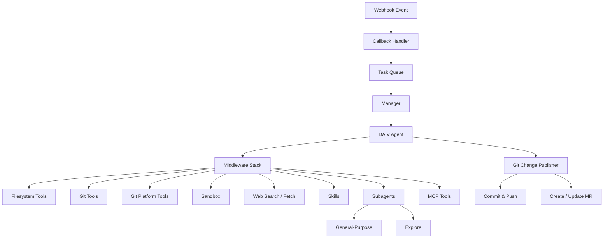

# Agent Architecture

DAIV uses a single AI agent built on [Deep Agents](https://github.com/langchain-ai/deepagents), a general-purpose deep agent framework from [LangChain](https://python.langchain.com/) with sub-agent spawning, middleware-based architecture, and virtual filesystem — all running on [LangGraph](https://langchain-ai.github.io/langgraph/). This page covers the technical architecture for those who want to understand how DAIV works under the hood.

## Overview

DAIV's architecture consists of:

- **One main agent** — handles all tasks (issue addressing, code review, slash commands)
- **Two subagents** — general-purpose (full tools) and explore (read-only, fast)
- **Middleware stack** — modular capabilities injected based on configuration
- **MCP servers** — external tool integrations (Sentry, Context7)

## End-to-end flow

1. **Webhook** — GitLab or GitHub sends an event (issue created, comment posted, etc.)
2. **Callback handler** — validates the webhook, extracts event data, enqueues a background task
3. **Manager** — sets up the runtime context (repository, branch, scope) and creates the agent
4. **Agent execution** — LangGraph runs the agent loop: call LLM → execute tools → repeat
5. **Publishing** — the agent commits changes, creates/updates a merge request, and leaves a comment

### Managers

Two managers orchestrate the agent:

| Manager | Trigger | Purpose |
|---------|---------|---------|
| `IssueAddressorManager` | Issue with `daiv` label | Plans and implements issue solutions |
| `CommentsAddressorManager` | `@daiv` mention on MR | Responds to code review comments |

Both create a persistent conversation thread (stored in Redis with 90-day TTL) so the agent retains context across multiple interactions on the same issue or MR.

## Tools

The agent's tools are injected via middlewares. Each middleware provides one or more tools and can be conditionally enabled.

### Filesystem

| Tool | Description |
|------|-------------|
| `glob` | Find files by pattern matching |
| `grep` | Search file contents with regex |
| `read_file` | Read file contents |
| `edit_file` | Modify existing files |
| `write_file` | Create new files |
| `ls` | List directory contents |

### Git platform

| Tool | Description |
|------|-------------|
| `gitlab` / `github` | Inspect issues, merge requests, pipeline status, and job logs |

### Sandbox

| Tool | Description |
|------|-------------|
| `bash` | Execute commands in a persistent, isolated Docker container |

Commands are evaluated against a [command policy](../features/sandbox.md) before execution. See [Sandbox](../features/sandbox.md) for details.

### Web

| Tool | Description |
|------|-------------|
| `web_search` | Search the web (DuckDuckGo or Tavily) |
| `web_fetch` | Fetch a URL, convert to markdown, and answer a prompt about its content |

### Skills

| Tool | Description |
|------|-------------|
| `skill` | Execute a [skill](../customization/agent-skills.md) (slash command) |

### MCP

External tools provided via [MCP servers](../customization/mcp-tools.md) (Sentry error tracking, Context7 documentation lookup).

## Middlewares

Middlewares are the backbone of the agent — they inject tools, system prompts, and lifecycle hooks. The agent is assembled dynamically based on which middlewares are enabled.

### Always enabled

| Middleware | Purpose |
|------------|---------|
| `FilesystemMiddleware` | File operations (glob, grep, read, edit, write) |
| `GitMiddleware` | Branch management, auto-commit, MR creation |
| `GitPlatformMiddleware` | Git platform CLI tool (issues, MRs, pipelines) |
| `SkillsMiddleware` | Skill loading and slash command execution |
| `SubAgentMiddleware` | Delegates tasks to subagents |
| `MemoryMiddleware` | Loads `AGENTS.md` and repository context |
| `TodoListMiddleware` | Task tracking within conversations |
| `SummarizationMiddleware` | Compresses conversation history when it grows too long |
| `AnthropicPromptCachingMiddleware` | Prompt caching for Anthropic models |
| `ToolCallLoggingMiddleware` | Logs all tool calls |
| `PatchToolCallsMiddleware` | Fixes malformed tool calls from the LLM |

### Conditionally enabled

| Middleware | Condition |
|------------|-----------|
| `SandboxMiddleware` | Sandbox is configured (`DAIV_SANDBOX_BASE_IMAGE` is set) |
| `WebSearchMiddleware` | Web search is enabled |
| `WebFetchMiddleware` | `AUTOMATION_WEB_FETCH_ENABLED` is `true` |
| `ModelFallbackMiddleware` | A fallback model is configured |
| `HumanInTheLoopMiddleware` | Plan approval is required (non-auto mode) |

## Subagents

The main agent can delegate work to two subagents. See [Subagents](../features/subagents.md) for the user-facing explanation.

| Subagent | Model | Tools | Use case |
|----------|-------|-------|----------|
| General-purpose | Same as main agent | Full tool access | Complex searches, multi-step research |
| Explore | Claude Haiku 4.5 (fast) | Read-only filesystem | Quick file lookups, code structure questions |

## Dynamic system prompt

The agent's system prompt is assembled at runtime and includes:

- Current date
- Bot username
- Repository URL and git platform
- Current branch and default branch
- Available tools and their descriptions
- Loaded skill metadata
- `AGENTS.md` content (if present in the repository)

This ensures the agent always has up-to-date context about the repository it's working in.

## Model configuration

Models are resolved at three levels (highest priority first):

1. **Issue labels** — `daiv-max` switches to a stronger model with higher thinking
2. **Repository config** — `.daiv.yml` [model overrides](../customization/repository-config.md#model-overrides)
3. **Environment variables** — global defaults (`DAIV_AGENT_*`)

See [Environment Variables](env-variables.md#daiv-agent) for all agent model settings.
